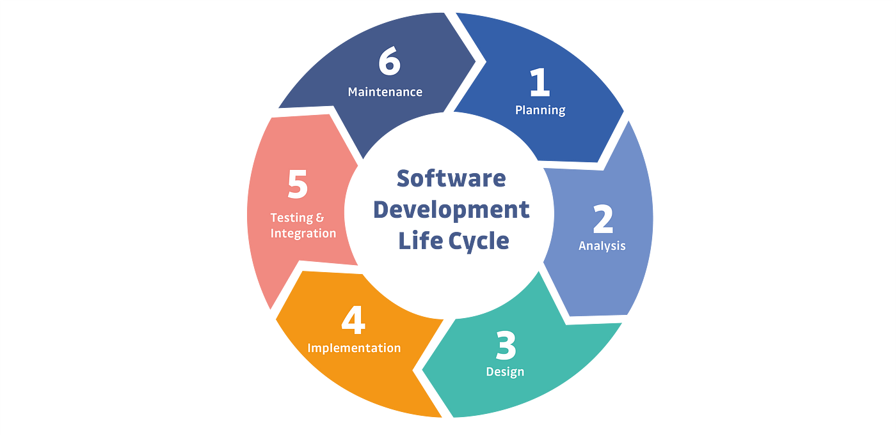

# DevOps

A culture that allows the development and operations teams to work together results in continuous development, testing, integration, deployment, and monitoring of the software throughout the lifecycle.

The DevOps lifecycle consists of eight phases representing the processes, capabilities, and tools needed for development (on the left side of the loop) and operations (on the right side of the loop). Throughout each phase, teams collaborate and communicate to maintain alignment, velocity, and quality.

IMP: *Improving delivery with automation*

## Why ?

Here are some key reasons why organizations adopt DevOps:

1. `Faster Time to Market`: DevOps practices streamline the software development lifecycle, enabling quicker deployment of features and updates.

2. `Improved Collaboration`: By breaking down silos between development and operations teams, DevOps fosters better communication, collaboration, and shared responsibilities.

3. `Increased Efficiency`: Automation of processes such as testing, integration, and deployment reduces manual effort and accelerates workflows.

4. `Enhanced Quality`: Continuous integration and continuous deployment (CI/CD) practices improve code quality by enabling frequent testing and feedback loops.

5. `Scalability and Flexibility`: DevOps practices make it easier to scale infrastructure and applications according to changing business needs.

6. `Better Reliability and Stability`: Continuous monitoring and feedback help identify and address issues proactively, ensuring a more stable and reliable application environment.

7. `Cost Efficiency`: Automation and efficient resource utilization lead to cost savings over time.

Overall, DevOps aims to align IT goals with business objectives, enhance customer satisfaction, and drive innovation through continuous improvement and iterative development practices.

------

## SDLC

SDLC stands for Software Development Life Cycle. It is a process to produce software with the highest quality and lowest cost in the shortest time possible. It provides a well-structured flow of phases that help organizations quickly produce higher-quality software.

Here are the typical phases of the SDLC:

1. `Planning`: Identifying project scope, requirements, goals, and feasibility analysis.

2. `Requirements Gathering`: Gathering and documenting user requirements for the software.

3. `Design`: Creating the architectural and detailed designs based on the requirements.

4. `Implementation`: Writing code based on the design specifications.

5. `Testing`: Executing tests to identify and fix defects and ensure software quality.

6. `Deployment`: Installing the software in the production environment.

7. `Maintenance`: Making updates, enhancements, and fixing issues that arise after deployment.

Each phase in the SDLC is crucial for delivering a high-quality software product that meets user needs. Various methodologies, such as Waterfall, Agile, and DevOps, dictate how these phases are executed and iterated upon throughout the development process.