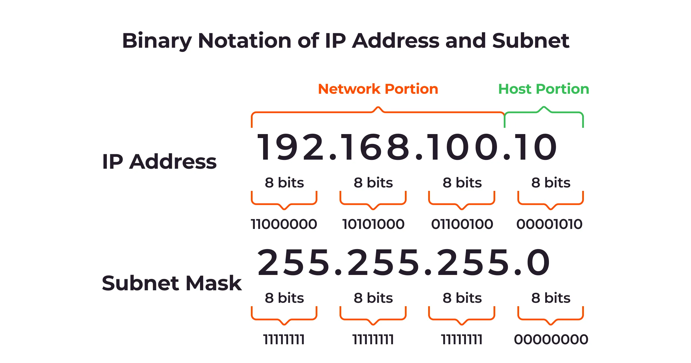

# Network

A network typically refers to the interconnected systems, services, and infrastructure components that enable communication and data exchange within an organization's IT environment.

key aspects of networks in DevOps:

1. `Infrastructure Connectivity`: Networks in DevOps encompass the physical and virtual connections between servers, databases, storage systems, and other IT resources. This connectivity forms the backbone for application deployment and operation.

2. `Communication Channels`: Networks provide the pathways through which various DevOps tools, services, and microservices communicate. This includes CI/CD pipelines, monitoring systems, logging services, and more.

3. `Security and Compliance`: Network configurations play a crucial role in ensuring the security and compliance of DevOps environments. This involves setting up firewalls, implementing secure communication protocols (e.g., HTTPS), and managing access controls.

4. `Scalability and Performance`: Network architecture impacts the scalability and performance of applications and services deployed in DevOps environments. Factors such as bandwidth, latency, and network topology are critical in optimizing these aspects.

5. `Monitoring and Troubleshooting`: DevOps teams monitor network metrics and logs to identify performance bottlenecks, potential security breaches, or other issues affecting application delivery. This monitoring is essential for maintaining the reliability and availability of services.

6. `Automation and Orchestration`: In modern DevOps practices, network configurations are often automated and orchestrated alongside other infrastructure components. This automation helps in achieving consistency, reliability, and rapid deployment of network resources.


## IP Address

An IP address, short for Internet Protocol address, is a unique numerical label assigned to each device connected to a computer network that uses the Internet Protocol for communication.

It serves two main purposes:

1. `Identification`: An IP address uniquely identifies a device (such as a computer, smartphone, or any networked device) on a network. It's similar to how a street address identifies a specific house in a neighborhood.

2. `Routing`: IP addresses are used for routing data packets between devices over a network. When you send or receive data over the internet or any network, the data is broken down into packets, each containing the destination IP address among other information. Routers and other networking equipment use this IP address to determine where to send each packet.

IP addresses are typically written in a decimal format, known as IPv4 (Internet Protocol version 4), which consists of four numbers separated by dots (e.g., 192.168.1.1). Each number can range from 0 to 255, giving a total of approximately 4.3 billion unique IPv4 addresses. With the growth of the internet and connected devices, a newer standard called IPv6 (Internet Protocol version 6) has been introduced, which provides a much larger address space to accommodate the increasing number of devices.


                                        Device A
                                        |
                                        | IP Address: 192.168.1.100
                                        |
                                        +-------------------+  Network (e.g., Internet)
                                                            |
                                                            |
                                                            Router
                                                            |
                                                            +-------------------+
                                                            |                   |
                                                        Device B             Device C
                                                    IP Address:             IP Address:
                                                    192.168.1.101          192.168.1.102


There are several types of IP addresses used in networking, each serving different purposes and roles. Here are the main types of IP addresses:

1. `Public IP Address`:
   - A public IP address is assigned to a device by its Internet Service Provider (ISP) and is unique across the entire internet. It allows devices to communicate directly with other devices over the internet.
   - Public IP addresses are used to identify devices on the global internet, such as web servers, email servers, and routers.

2. `Private IP Address`:
   - A private IP address is used within a private network, such as a home or business network, and is not routable on the internet.
   - Private IP addresses are defined in RFC 1918 and include ranges like 192.168.x.x, 172.16.x.x - 172.31.x.x, and 10.x.x.x.
   - Devices within the same private network can communicate with each other using private IP addresses, and a router or gateway with a public IP address handles communication with the internet.

3. `Static IP Address`:
   - A static IP address is manually configured for a device and remains constant, unlike a dynamic IP address that may change periodically.
   - Static IP addresses are often used for servers, network equipment, or devices that require consistent, predictable IP addresses for remote access or services.

4. `Dynamic IP Address`:
   - A dynamic IP address is automatically assigned to a device by a DHCP (Dynamic Host Configuration Protocol) server. It may change each time the device connects to the network or periodically according to DHCP lease settings.
   - Dynamic IP addresses are commonly used for personal computers, smartphones, and devices that don't require a fixed IP address.

5. `Reserved IP Address`:
   - Reserved IP addresses are set aside for special purposes or specific uses within a network.
   - Examples include the loopback address (127.0.0.1), used for internal testing and communication within a device itself, and other reserved addresses defined by RFCs for specific networking purposes.

6. `IPv4 and IPv6 Addresses`:
   - IPv4 addresses are 32-bit numerical addresses, currently the most widely used addressing protocol on the internet.
   - IPv6 addresses are 128-bit numerical addresses, designed to replace IPv4 due to its limited address space. IPv6 adoption is increasing to accommodate the growing number of internet-connected devices.

## Subnet

A subnet (short for subnetwork) is a logical subdivision of an IP network. It allows large networks to be divided into smaller, manageable parts for easier administration, security, and performance optimization.

1. `IP Address Range`: Each subnet has its own range of IP addresses, which are a subset of the larger network's IP address range.
   
2. `Subnet Mask`: Determines which part of the IP address is the network portion and which part is the host portion. It is represented in the form of a binary mask (e.g., 255.255.255.0).

3. `Purpose`: Subnets help in organizing and securing network traffic. They can isolate network segments for different departments, functions, or security levels.


```
                                            Network
                                          192.168.1.0
                                               |
                                        +----------------+
                                        |   Subnet 1     |   Subnet 2     |   Subnet 3
                                        | 192.168.1.0/24 | 192.168.2.0/24 | 192.168.3.0/24
                                        +----------------+----------------+----------------
```

`NOTE`: A subnet mask is a 32-bit number used to divide an IP address into network and host portions. It is represented in dotted decimal notation similar to an IP address, such as 255.255.255.0. 

When a network administrator wants to create subnets from a larger IP address range (say a Class C network, which traditionally has 256 IP addresses), they use the subnet mask to divide this range into smaller parts.

For example, let's take the IP address range 192.168.1.0 to 192.168.1.255 (which is a Class C network):

   - IP Range: 192.168.1.0 - 192.168.1.255
   - Subnet Mask: 255.255.255.0 (which is /24 in CIDR notation) [CIDR notation represents IP addresses and their associated subnet masks using a format like IP_address/Prefix_length. For example, 192.168.1.0/24 indicates an IPv4 network where the first 24 bits are the network part and the remaining 8 bits are the host part.]



The subnet mask defines how many bits are used for the network portion and how many are used for the host portion of the IP address.

   - `Subnet Mask in Binary`: 255.255.255.0 is 11111111.11111111.11111111.00000000 in binary.
   - This means the first 24 bits (8 bits + 8 bits + 8 bits) are used for the network portion, and the remaining 8 bits are used for the host portion.

### Calculating Subnets:

With a /24 subnet mask (255.255.255.0):

   - `Network Portion`: The first three octets (192.168.1) are the network portion.
   - `Host Portion`: The last octet (0 to 255) represents hosts within that network.
  
```IMP
    32 bite - 24 bite (/24 bite) = 8 => 2^8 => 256 IPs
```


Example Subnets:

   1. `Subnet 1`: 192.168.1.0/24 (Network ID: 192.168.1.0, Broadcast Address: 192.168.1.255)
      - Host Range: 192.168.1.1 - 192.168.1.254 (254 usable IP addresses)

   2. `Subnet 2`: 192.168.1.128/25 (Network ID: 192.168.1.128, Broadcast Address: 192.168.1.255)
      - Host Range: 192.168.1.129 - 192.168.1.254 (126 usable IP addresses)

   3. `Subnet 3`: 192.168.1.192/26 (Network ID: 192.168.1.192, Broadcast Address: 192.168.1.255)
      - Host Range: 192.168.1.193 - 192.168.1.254 (62 usable IP addresses)

Each subnet has its own network ID, broadcast address, and range of usable IP addresses. The subnet mask determines the boundary between the network portion and the host portion of the IP address, allowing for efficient allocation and management of IP addresses within a network.

## Public vs Private Subnet

`public subnet`
   - A public subnet refers to a range of IP addresses that are routable over the Internet.
   - These IP addresses can be accessed and communicated with directly from outside the local network.
   - Public subnets are used for servers, services, or devices that need to be accessed from the Internet, such as web servers, email servers, and public-facing applications.
  
`Private Subnet`
   - A private subnet refers to a range of IP addresses that are not routable over the public Internet.
   - These IP addresses are used within a private network and are not accessible directly from outside the local network without using techniques like Network Address Translation (NAT) or a proxy server
   - Private subnets are commonly used for internal devices, servers, and services that do not need direct exposure to the Internet, such as internal databases, printers, and IoT devices.
   - EX: general convention: private IP start with 192,172,10

Public and private subnets serve distinct purposes within network architecture. Public subnets facilitate external communication and are exposed to the Internet, requiring stringent security measures. In contrast, private subnets are used for internal communication within a private network, offering enhanced control and security but limited external accessibility without specific configurations like NAT or VPNs.

## PORT

In networking, a "port" refers to a communication endpoint or a logical construct that identifies a specific process or service on a networked device. Here's a brief overview of what a port is and how it functions:

These processes use ports to send or receive data over a network. For example, a web server runs on port 80 (HTTP) or 443 (HTTPS). Other examples include email servers (which might use ports 25, 465, or 587) and file transfer protocols.

**Port:** In the context of networking, a port is a numeric identifier that distinguishes one endpoint of a communication from another on the same network device or across a network. It allows multiple processes to share the same IP address on the same device.

Ports are numbered from 0 to 65535, with well-known ports reserved for specific protocols (e.g., port 80 for HTTP, port 443 for HTTPS).


```
                                Computer or
                                Network Device
                                    |
                            +-----+-----+
                            | Port 80   |  Web Browser
                            | HTTP      +---------------> Internet
                            +-----------+

                            +-----+-----+
                            | Port 25   |  Email Client
                            | SMTP      +---------------> Email Server
                            +-----------+
```

1. `Port Number:`
   - Ports are identified by numbers ranging from 0 to 65535.
   - Well-known ports (0 to 1023) are reserved for specific services and protocols (e.g., HTTP uses port 80, HTTPS uses port 443).
   - Registered ports (1024 to 49151) are assigned by IANA (Internet Assigned Numbers Authority) upon request for specific purposes.
   - Dynamic or private ports (49152 to 65535) are used for temporary connections and applications.

2. `Types of Ports:`
   - **TCP (Transmission Control Protocol) Ports:** Used for connection-oriented communication, ensuring data reliability through acknowledgments.
   - **UDP (User Datagram Protocol) Ports:** Used for connectionless communication, suitable for applications that prioritize speed over reliability.

3. `Port Allocation:`
   - Ports enable simultaneous communication between multiple applications or services running on the same device.
   - They facilitate the routing of data packets to the correct application or service based on the port number and the IP address.

4. `Usage:`
   - Ports are integral to various internet protocols and services, including web browsing, email (SMTP, POP3, IMAP), file transfer (FTP), and remote access (SSH, RDP).

## IMP Points

 - IP addresses identify devices, while ports identify specific services/process or applications running on those devices.
  
 - IP addresses enable devices to find each other on a network, while ports enable multiple applications or services to operate independently on the same device.
 
 - Only those processes that involve network communication will be associated with a port number. Most other processes on a computer or server won't use ports at all. 

```
                     Device (e.g., Computer)
                            |
                            |  IP Address (e.g., 192.168.1.1)
                            |
                            +-------------------+
                            | Port 80 (HTTP)    |  Web Browser
                            | Port 443 (HTTPS)  |  Email Client
                            +-------------------+
```

## DNS (Domain Name System)

The Domain Name System (DNS) is a fundamental component of the internet infrastructure. It translates human-readable domain names (like `www.example.com`) into IP addresses (like `192.0.2.1`), which are used by computers to locate and communicate with each other over the internet.

   - `Structure`: DNS is organized in a hierarchical structure. At the top of the hierarchy are the root servers, followed by top-level domains (TLDs) like `.com`, `.org`, and `.net`, and then second-level domains (e.g., `example.com`), and further subdomains (e.g., `www.example.com`).
     
Example: In `www.example.com`, `com` is the TLD, `example` is the second-level domain, and `www` is a subdomain.


`DNS Resolution`
---

                                    User Request
                                          |
                                          v
                                 +------------------+
                                 |  DNS Resolver    |
                                 +------------------+
                                          |
                                          v
                                 +------------------+
                                 |   Root DNS Server|
                                 +------------------+
                                          |
                                          v
                                 +------------------+
                                 |  TLD DNS Server  |  (e.g., for .com)
                                 +------------------+
                                          |
                                          v
                                 +------------------+
                                 | Authoritative    |
                                 | DNS Server       |  (e.g., for example.com)
                                 +------------------+
                                          |
                                          v
                                    IP Address Returned
                                          |
                                          v
                                 User's Browser Connects

Explanation of Each Step

1. `User Request`:
   - The process starts when a user enters a domain name (e.g., `www.example.com`) into their web browser.

2. `DNS Resolver`:
   - The DNS Resolver, also known as a recursive resolver, is a server that receives the user's DNS query. Its job is to resolve the domain name into an IP address by querying other DNS servers as needed.
   - If the resolver already has the answer cached from a previous request, it can immediately return the IP address to the user's browser. If not, it proceeds to resolve the query by querying other DNS servers.

3. `Root DNS Server`:
   - If the resolver does not have the IP address cached, it first queries a Root DNS Server. Root DNS Servers are at the top of the DNS hierarchy and can direct the resolver to the appropriate Top-Level Domain (TLD) DNS server based on the domain's extension (e.g., `.com`, `.org`, `.net`).

4. `TLD DNS Server`:
   - The Root DNS Server responds by directing the resolver to the relevant TLD DNS Server. The TLD server is responsible for knowing which authoritative DNS server handles the domain names under its specific TLD (e.g., `.com`).
   - For instance, for `www.example.com`, the resolver is directed to the TLD DNS server that handles `.com` domains.

5. `Authoritative DNS Server`:
   - The TLD DNS Server then directs the resolver to the authoritative DNS server for the specific domain. The authoritative DNS server holds the actual DNS records for the domain (e.g., `example.com`).
   - This server provides the resolver with the IP address associated with the requested domain name.

6. `IP Address Returned`:
   - The resolver receives the IP address from the authoritative DNS server and returns it to the user's browser.

7. `User's Browser Connects`:
   - With the IP address in hand, the browser can now connect directly to the web server at that IP address to retrieve and display the requested web page.
