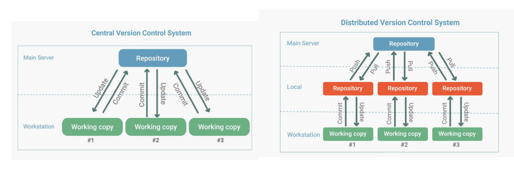

# GIT

Git is a distributed version control system (DVCS) that helps developers track changes in source code during software development. It allows multiple developers to work on projects simultaneously, coordinating their work and integrating changes seamlessly. Git is widely used for managing code bases of all sizes, from small personal projects to large enterprise applications.

## CVS vs DVC

  CVS (Centralized Version Control)

    +-----------------------+
    |    Central Repository |
    +-----------------------+
    |                       |
    |   Developer Machines  |
    |                       |
    +-----------------------+

    Developers interact with a central repository where all code and history are stored. Operations like commits, updates, and merges require network access to the central server. Branching and merging are supported but typically involve operations directly on the central repository.

------------------------------------------------------

  DVC (Distributed Version Control - e.g., Git)

    +-----------------------+
    |  Local Developer Repo |
    +-----------------------+
    |    Local Developer    |
    |       Machines        |
    +-----------------------+
             |
             |
             v
    +-----------------------+      +-----------------------+
    | Remote Central Repo   | <--> | Remote Developer Repo |
    +-----------------------+      +-----------------------+

    Each developer has a complete copy (local repository) of the entire project history on their local machine. Developers can work independently and commit changes locally. Synchronization with remote repositories (central or other developers' repos) happens when network access is available. Branching and merging are lightweight and can be done locally before pushing changes to shared remote repositories.


 - CVS is a centralized version control system where all code and version history reside in a single central repository. Developers interact with this repository to commit changes, update their local copies, and merge branches. This centralized structure requires constant network connectivity to perform operations, making it less suitable for scenarios where network access is limited or unstable. Branching and merging in CVS are supported but can be more cumbersome compared to modern distributed systems. CVS maintains a linear history of changes, offering centralized control over backups and access permissions.

 - In contrast, DVC, exemplified by systems like Git, operates on a distributed model where each developer maintains a complete copy of the repository, including its entire history, on their local machine. This decentralized approach enables developers to work offline, commit changes locally, and synchronize with remote repositories at their convenience. Branching and merging are fundamental features in DVC, facilitating parallel development and flexible workflows. Each local repository serves as a full backup, enhancing redundancy and data integrity. Git, in particular, has gained widespread adoption in software development due to its robust branching model, support for distributed workflows, and resilience in diverse collaboration scenarios.




## git folder


In Git, the `.git` folder is a crucial component of every Git repository. It's a hidden directory located in the root directory of your Git repository, and it contains all the metadata and configuration information that Git needs to manage your project's version control. Here’s what you can find inside the `.git` folder:

1. `Repository Configuration`: The `.git/config` file stores configuration settings specific to your repository, such as remote repository URLs, branch settings, and user information.

2. `Repository Metadata`: The `.git/objects` directory contains all the commits, trees, and blobs that represent the history of your repository. Each file in this directory is hashed and compressed to save space and ensure data integrity.

3. `Branches and Head Pointer`: The `.git/refs` directory holds references to commits, tags, and heads (branches). For example, `.git/refs/heads` stores the references to branch heads, and `.git/refs/tags` stores references to tags.

4. `Commit Logs`: The `.git/logs` directory contains logs of various actions performed on the repository, such as commits, fetches, and merges.

5. `Index File`: The `.git/index` file is also known as the "staging area" or "cache". It holds a snapshot of the content of the working tree and is used to build the next commit.

6. `Hooks`: The `.git/hooks` directory contains scripts that Git executes before or after certain actions, such as committing or merging. These scripts can be customized to automate tasks or enforce policies.

7. `Configuration Templates`: The `.git/templates` directory holds template files used when initializing new repositories or cloning existing ones. These can be customized to include default files or configurations.

Visibility and Management:

   - `Hidden Directory`: The `.git` directory is hidden by default in many file explorers and command-line interfaces because its name begins with a dot (`.`). This prevents accidental modification or deletion of critical repository data.

   - `Backup Considerations`: It’s essential to back up the `.git` directory along with your project files to ensure you can restore your repository in case of data loss or corruption.

   - `Cloning and `.git``: When you clone a Git repository from a remote server using `git clone`, Git copies the entire `.git` directory along with your project files to your local machine. This allows you to work with the complete history and metadata of the repository locally.
  


## Git commands 

Configuration
   - `git config --global user.name "Your Name"`: Set your username globally.
   - `git config --global user.email "your.email@example.com"`: Set your email globally.
   - `git config --global color.ui auto`: Enable helpful colorization of Git output.

Starting a Repository
   - `git init`: Initialize a new Git repository in the current directory.
   - `git clone <repository-url>`: Clone a repository from a remote server to your local machine.

Basic Snapshotting
   - `git add <file>`: Add file(s) to the staging area.
   - `git commit -m "Commit message"`: Commit staged changes to your local repository.

Branching & Merging
   - `git branch`: List all branches in the repository.
   - `git branch <branch-name>`: Create a new branch.
   - `git checkout <branch-name>`: Switch to a different branch.
   - `git merge <branch-name>`: Merge changes from one branch into the current branch.
   - `git rebase <branch-name>`: Reapply commits on top of another base tip.

Inspecting & Comparing
   - `git status`: Show the status of files in the repository.
   - `git log`: Show the commit history.
   - `git diff`: Show changes between commits, commit and working tree, etc.

Working with Remotes
   - `git remote add <name> <url>`: Add a new remote repository.
   - `git fetch <remote>`: Download objects and refs from another repository.
   - `git pull <remote> <branch>`: Fetch from and integrate with another repository or a local branch.
   - `git push <remote> <branch>`: Update remote refs along with associated objects.

Undoing Changes
   - `git reset HEAD <file>`: Unstage a file from the staging area.
   - `git checkout -- <file>`: Discard changes in the working directory for a specific file.
   - `git revert <commit>`: Create a new commit that undoes changes made in a previous commit.

Miscellaneous
   - `git tag <tag-name>`: Create a tag for a specific commit.
   - `git stash`: Stash changes in a dirty working directory away.
   - `git submodule`: Initialize, update or inspect submodules.

-

## IMP

1. `git pull -r` 
    (git pull --rebase) is a command used to fetch and integrate changes from a remote repository into your local branch using rebase instead of merge, maintaining a cleaner and more linear commit history. Use it when you prefer a streamlined history and understand the implications of rebasing on collaborative workflows.

    ```s
    git pull -r origin main
    ```

2. `merge vs rebase` :  

    - are two different strategies in Git used to integrate changes from one branch into another.

    - `Merge`:combines the changes from two branches and creates a merge commit. It preserves the history of both branches, which can make it easier to understand the context of changes but can also create a more complex commit history.
       Use merge when preserving the full history of changes and the branching structure is important. It's generally safer and simpler for collaborative workflows, especially with shared branches like main or develop.  When you merge branches, Git takes the endpoint of both branches and creates a new commit that combines the changes. This results in a merge commit, which has two parent commits (one from each branch).

    - `Rebase`: moves or reapplies commits from one branch onto another. It results in a linear commit history and is useful for cleaning up history before merging. However, it rewrites commit history, which can be problematic if the branch is shared with others.
      Use rebase when you want to maintain a cleaner and more linear history. It's particularly useful for feature branches or when preparing a branch for integration into another branch (like main or develop). However, exercise caution when rebasing commits that have already been pushed and shared with others. Git takes the commits from your current branch (say, a feature branch) and places them on top of another branch (usually master or another main branch).
      - 

1. `git rm --cached path/to/file_name`: To remove a file from both your local repository and the remote 

2. `git push -d origin branch_name`: delete the file in the remote

3. `git reset --hard <commit_hash>`: to revert to a specific commit in local
        
    ```s
        # Revert changes locally
        git checkout -- myfile.txt

        # Stage changes (if necessary) and commit
        git add myfile.txt
        git commit -m "Reverting changes to myfile.txt"

        # Push changes to remote (if necessary)
        git push origin main
    ```

    `--hard` is typically used when you want to completely discard changes and start over from a specific commit. Use it with caution because it permanently removes uncommitted changes.

    `--soft` is useful when you want to undo a commit but keep the changes in your working directory and staging area for further modifications or corrections before committing again.


6. `git commit --amend` : command is used to modify the last commit in Git. It combines staged changes with the previous commit, effectively allowing you to edit the last commit message or add more changes to it.

7. `git reset` and `git revert` : are both Git commands used to undo changes
   
   - Permanent vs. Safe Undo: git reset modifies the commit history and is considered a more aggressive change because it can discard changes permanently (--hard reset). git revert, on the other hand, creates new commits to undo changes, leaving the original commits intact.

   - Effect on Collaborators: git reset can potentially disrupt collaborators' work if used after pushing changes to a shared repository, especially if you force-push (--force). git revert is safer in shared environments as it maintains the existing commit history.

   - Commit History: git reset rewrites the commit history, while git revert adds new commits to undo changes, preserving the commit history's integrity.
  
   -  `git reset` is used to rewrite history and make changes locally, while `git revert` is used to safely undo changes in a way that preserves commit history and is suitable for shared repositories.

8. `Fork`: 
   
   - A fork creates a fully independent copy of a Git repository. When you fork a repository, you duplicate the entire project, including its files, branches, and commit history. This copy resides under your own account on the hosting platform (like GitHub). Changes made to a fork do not affect the original repository unless you explicitly propose those changes back through a pull request.

   - On the other hand, when you clone a repository with Git, you create a linked copy that initially mirrors the target repository. A clone allows you to work with the project locally on your own machine. Unlike a fork, which is a distinct copy, a clone can be kept synchronized with the original repository by pulling in updates made to the remote repository. This synchronization enables you to work with the most current version of the project and collaborate effectively with others.

9. `git merge --no-ff feature/new-feature`
`--no-ff`
   - The --no-ff option stands for "no fast-forward". It modifies the behavior of the merge:

   - Fast-Forward Merge: By default, if the current branch can be fast-forwarded to include the commits from the branch being merged (i.e., if there’s a direct path from the current branch to the tip of the branch being merged), Git performs a fast-forward merge. This means Git just moves the branch pointer forward to the tip of the other branch without creating a new merge commit.

   - No Fast-Forward (--no-ff): When you use --no-ff, Git will always create a new merge commit even if a fast-forward merge is possible. This ensures that the merge is recorded with a distinct commit, which maintains a clear history of the branch integration.


## Git Hooks

Git hooks are scripts that Git executes before or after certain actions such as commit, push, and receive. They are customizable and allow developers to automate tasks and enforce workflows. 

Types of Git Hooks:

1. `Client-side Hooks:`
   - Pre-commit: Executes before a commit is made. Useful for syntax checking, code linting, or ensuring commit message conventions.
   
   - Prepare-commit-msg: Executes before the commit message editor is launched. It can be used to manipulate the commit message programmatically.
   
   - Post-commit: Executes after a commit is successfully made. It can be used for tasks like notification or logging.

2. `Server-side Hooks:`
  
   - Pre-receive: Executes on the server before updating the remote repository. It can be used to enforce policies like rejecting certain pushes based on criteria such as commit messages or file types.
  
   - Update: Executes when a branch is updated with new commits. It can be used to validate changes or enforce branch-specific rules.
  
   - Post-receive: Executes after the changes have been accepted and all refs have been updated. It can be used for tasks like triggering builds or notifications.


How to Use Git Hooks:

  - `Location`: Git hooks are stored in the `.git/hooks/` directory of your Git repository. Each hook is a script file with a specific name (e.g., pre-commit, post-commit, pre-push, etc.).

  - `Customization`: To use a hook, create a script file with the appropriate name (e.g., `pre-commit`), make it executable (`chmod +x pre-commit`), and write your custom logic inside the script.

  - Example: Pre-commit Hook (`.git/hooks/pre-commit`):
     ```bash
     #!/bin/bash
     
     # Example pre-commit hook: Run linting before allowing a commit
     echo "Running linting..."
     npm run lint
     if [ $? -ne 0 ]; then
         echo "Linting failed. Commit aborted."
         exit 1
     fi
     ```

  - `Execution`: Git hooks are executed synchronously. If a hook script exits with a non-zero status, the corresponding Git command (e.g., `git commit`) will be aborted.


Benefits of Git Hooks:

- `Automation`: Hooks automate tasks that developers would otherwise need to perform manually, such as ensuring code quality or enforcing project-specific guidelines.
  
- `Enforcement`: They enforce consistent workflows and standards across team members, improving code quality and adherence to project guidelines.

- `Integration`: Hooks can integrate with external tools and services (e.g., CI/CD pipelines) to automate build and deployment processes.


## Branch naming conventions 

General Principles:

  1. `Use Descriptive Names`: Branch names should clearly indicate the purpose or goal of the branch.

  2. `Keep It Short and Meaningful`: Aim for concise names that convey the branch's intent at a glance.

  3. `Avoid Special Characters`: Stick to alphanumeric characters, dashes (`-`), and underscores (`_`). Avoid spaces, periods, and other special characters that might cause issues in some Git tools.

  4. `Use Lowercase`: Branch names are typically lowercase to ensure compatibility across different operating systems and Git platforms.

--

`feature/<short-description>` : Used for developing a new feature or functionality.

`bugfix/<issue-number>-<short-description>`:  Purpose: Used for fixing bugs, where `123` is the issue number from your issue tracking system.

`release/<version-number>`: Used for preparing a new release version. (release/1.0.0)

`hotfix/<version-number>-<short-description>`: Used for quickly fixing critical issues in a released version.


## branching strategy 
A branching strategy defines how branches are organized and managed within a Git repository. It establishes rules and guidelines for creating, naming, merging, and deleting branches to facilitate collaboration, maintain code quality, and manage releases effectively. Here’s an overview of commonly used branching strategies:

1. Feature Branching Workflow

   - Overview: Each new feature or task is developed in a dedicated branch branched off from the main development branch (`main` or `develop`).

   - Workflow:
     - `Create Feature Branch`: Developers create a new branch for each feature or task.
       ```bash
       git checkout -b feature/new-feature main
       ```
     - `Work on Feature`: Make changes, commit regularly to the feature branch.
       ```bash
       git add .
       git commit -m "Implement feature XYZ"
       ```
     - `Merge`: Once complete, merge the feature branch back into `main` or `develop` via a pull request or merge request.
       ```bash
       git checkout main
       git merge --no-ff feature/new-feature
       git push origin main
       ```

   - Benefits: Encourages isolation of changes, parallel development, and easy collaboration on features.

2. Gitflow Workflow

   - Overview: Defines a strict branching model designed around project releases.

   - Branches:
     
     - `Main Branches`:
       - `main`: Represents production-ready code.
       - `develop`: Integration branch for ongoing development.
     
     - `Supporting Branches`:
       - `feature/*`: New features.
       - `release/*`: Preparing for a new production release.
       - `hotfix/*`: Emergency fixes in production.
       - `support/*`: Maintenance or hotfixes for older releases.

   - Workflow:
     - `Feature Development`:
       - Create feature branch off `develop`.
       - Merge feature branch back into `develop`.
     - `Release Preparation`:
       - Create release branch from `develop`.
       - Test and fix issues in the release branch.
       - Merge release branch into `main` and `develop`.
     - `Hotfixes`:
       - Create hotfix branch from `main`.
       - Merge hotfix branch into `main` and `develop`.

   - Benefits: Clear separation of feature development, stable release preparation, and hotfix management.

3. Trunk-Based Development

   - Overview: Promotes continuous integration and frequent commits to a single main branch (`main`).

   - Workflow:
     - Developers work directly on `main` or short-lived feature branches.
     - Emphasizes small, frequent commits and fast integration.
     - Automated testing ensures code stability before merging.

   - Benefits: Simplifies branch management, encourages rapid feedback, and reduces integration issues.


## Git Questions

1. What is the difference between `git merge` and `git rebase`?

   - `git merge` combines the changes from two branches and creates a merge commit. It preserves the history of both branches, which can make it easier to understand the context of changes but can also create a more complex commit history.
   - `git rebase` moves or reapplies commits from one branch onto another. It results in a linear commit history and is useful for cleaning up history before merging. However, it rewrites commit history, which can be problematic if the branch is shared with others.

2. Explain the concept of "detached HEAD" in Git.

   - A detached HEAD state occurs when you check out a specific commit rather than a branch. This means you're not on any branch, and any changes you make will not be associated with a branch unless you explicitly create a new branch. To return to a branch from this state, use:
     ```bash
     git checkout <branch>
     ```

3. What are some best practices for Git branching strategies in a DevOps environment?

   - Common best practices include:
     -Feature Branching: Develop features in separate branches and merge them into `main` or `develop` branches after testing.
     -Git Flow: Use a branching model with `main`, `develop`, `feature`, `release`, and `hotfix` branches to manage development and release cycles.
     -Trunk-Based Development: Keep the `main` branch stable and ensure that all changes are integrated into it frequently, with short-lived feature branches or direct commits.

4. How do you handle secrets and environment configurations in a Git-based DevOps setup?

   - Secrets and environment configurations should not be stored directly in Git repositories. Instead, use environment-specific configuration management tools or secret management services (e.g., AWS Secrets Manager, HashiCorp Vault). In CI/CD pipelines, you can use environment variables or secure storage solutions provided by the CI/CD tool to handle sensitive data securely.

