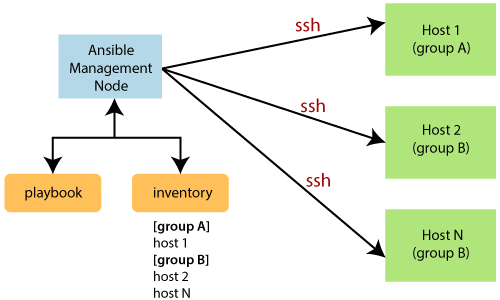

# Ansible

Ansible is an open-source `automation  tool` that simplifies the process of IT infrastructure management, application deployment, and task automation. It operates by using SSH to connect to servers and run predefined tasks, called "playbooks," written in YAML format.

## Ansible Configuration Files Overview

Ansible utilizes configuration files to govern its default behavior and settings. The default configuration file is located at `/etc/ansible/ansible.cfg`.

1. `Sections and Options:`

    - Configuration files are structured into sections such as default, inventory, ssh_connection, etc.
    - Each section contains various options that define Ansible's behavior.

2. `Customization and Overrides:`

    - **Local Overrides**: Create copies of `ansible.cfg` in specific directories (e.g., for different playbooks).
    - **Environment Variables**: Use `ANSIBLE_CONFIG` to specify a custom configuration file path.
    - **Prioritization**: 
        1. Environment variables take highest precedence.
        2. Local `ansible.cfg` in the current directory.
        3. `.ansible.cfg` in the user's home directory.
        4. Default `/etc/ansible/ansible.cfg`.

3. ` Selective Parameter Override:`
   - Adjust single parameters using environment variables (e.g., `ANSIBLE_GATHERING`).
   - Highest precedence ensures that the specified value overrides any conflicting setting in other files.


Finding Configuration Options:
   - Use `ansible-config list` to list available configuration options and their default values.
   - Check active configuration with `ansible-config view`.
   - Troubleshoot with `ansible-config dump` to see current active settings and their sources.

```yaml
[Environment Variable] > [Local ansible.cfg] > [.ansible.cfg] > [/etc/ansible/ansible.cfg]
```


## Ansible Inventory

In Ansible, an inventory is a collection of hosts or nodes that Ansible manages. It defines the machines or systems on which Ansible commands and playbooks operate. There are different types of inventories based on how they are defined and structured. Here are the main types:

1. Static Inventory

Static inventory is manually defined in a file (typically named `inventory` or specified with `-i` flag in Ansible commands). Hosts and their attributes are explicitly listed in this file.

```ini
  [web_servers]
  server1.example.com
  server2.example.com

  [db_servers]
  database1.example.com
  database2.example.com

  [load_balancers]
  lb1.example.com
```

2. Dynamic Inventory

Dynamic inventory scripts generate inventory information dynamically based on external data sources such as cloud providers, database queries, or other sources of truth. Ansible uses these scripts to dynamically generate the inventory at runtime.

**Example**: Using an AWS EC2 dynamic inventory script (`ec2.py`):
```bash
ansible-playbook -i /path/to/ec2.py playbook.yml
```

3. INI File Format

The INI file format is commonly used for defining static inventories. It allows grouping hosts into categories (also called groups) and assigning variables to hosts or groups.

**Example**:
```ini
  [web_servers]
  server1.example.com
  server2.example.com

  [db_servers]
  database1.example.com
  database2.example.com

  [web_servers:vars]
  ansible_user=admin
  ansible_ssh_private_key_file=/path/to/private_key.pem
```

4. YAML File Format

YAML format inventories provide more flexibility and readability compared to INI files. They support nested structures and allow more complex data representations.


```yaml
all:
  children:
    web_servers:
      hosts:
        server1.example.com:
        server2.example.com:
    db_servers:
      hosts:
        database1.example.com:
        database2.example.com:
    load_balancers:
      hosts:
        lb1.example.com:
```

5. Multiple Inventory Files

Ansible allows specifying multiple inventory files or directories. This is useful for organizing inventory data across different environments (e.g., production, staging).

```bash
ansible-playbook -i inventory/production playbook.yml
ansible-playbook -i inventory/staging playbook.yml
```

6. External Inventory Plugins

Custom external inventory plugins can extend Ansible’s inventory capabilities. These plugins can pull inventory information from various sources like databases or external APIs.

A custom Python script (`my_custom_inventory.py`) as an external inventory plugin.

## Choosing Inventory Formats in Ansible

In Ansible, the choice of inventory format depends on the scale and complexity of your infrastructure. Whether you're managing a small startup or a multinational corporation with diverse operations, Ansible offers two main inventory formats: INI and YAML.

1. `INI Format Overview:`
   
  - Suitable for small setups like startups.
  - Resembles a basic organizational chart with departments listed in a straightforward manner.
  - Servers are grouped under headings (`[web]`, `[database]`).
  - Each server is identified by its hostname or IP address using `ansible_host`.


```ini
  [web]
  server1 ansible_host=192.168.1.101
  server2 ansible_host=192.168.1.102

  [database]
  server3 ansible_host=192.168.1.103
```

2. `YAML Format Overview`

  - Ideal for large-scale deployments like multinational corporations.
  - Allows hierarchical structuring with departments, sub-departments, and teams.
  
```yaml
  all:
    children:
      web:
        hosts:
          server1:
            ansible_host: 192.168.1.101
          server2:
            ansible_host: 192.168.1.102
      database:
        hosts:
          server3:
            ansible_host: 192.168.1.103
```

   - YAML format supports nested structures (`children`, `hosts`) for detailed organization.
   - Provides flexibility to categorize servers based on roles (`web`, `database`), geographic locations, or other criteria.


In a complex IT infrastructure with hundreds of servers across various locations and purposes, managing individual servers manually can be inefficient and error-prone. Ansible's grouping feature provides a solution by allowing servers to be categorized based on roles, locations, or other criteria, simplifying management and operations.

By leveraging Ansible's grouping and parent-child relationships, IT administrators can effectively manage large-scale server infrastructures, streamline operations, and maintain configuration consistency across diverse environments. Choose the grouping strategy that best suits your organizational needs to enhance efficiency and reduce administrative overhead.

## Overview of Variables in Ansible

Variables in Ansible are essential for managing configurations that vary across hosts or environments. They store dynamic values such as host names, IP addresses, passwords, and configuration parameters that are used within playbooks to maintain flexibility and reusability.

1. Definition and Types of Variables:
   - `String Variables:` Sequences of characters, e.g., `username: admin`.
   - `Number Variables:` Hold integer or floating-point values, e.g., `max_connections: 100`.
   - `Boolean Variables:` Hold true or false values, e.g., `debug_mode: true`.
   - `List Variables:` Ordered collections of values, e.g., `packages: [nginx, mysql, php]`.
   - `Dictionary Variables:` Hold key-value pairs, e.g., `user: {name: John, age: 30}`.

2. Scope of Variables:
   - `Host Scope:` Variables defined for a specific host. These can be set in the inventory file (`ansible_host`) or specific host files (`host_vars/web.yml`). Host variables override group variables.
   - `Group Scope:` Variables defined for a group of hosts, e.g., `dns_server` defined for a group `Web Servers`.
   - `Play Scope:` Variables defined within a playbook. They override both host and group variables if defined.
   - `Global Scope:` Variables passed as `extra-vars` via command line. These have the highest precedence.

3. Variable Precedence:
   - Variables defined at the host level override variables defined at the group level.
   - Playbook-level variables override both group and host variables.
   - `extra-vars` passed via command line have the highest precedence and override all other definitions.

4. Using Variables:
   - Variables are accessed in playbooks using double curly braces `{{ variable_name }}`.
   - Variables can be defined inline in playbooks, in inventory files, or in dedicated variable files (`host_vars`, `group_vars`).
   - Jinja2 templating syntax is used for complex variable manipulations and conditionals within Ansible playbooks.

5. Magic Variables:
   - `Hostvars:` Access variables of other hosts within a playbook using `hostvars[hostname].variable_name`.
   - `Groups:` Retrieve all hosts under a specific group using `groups[group_name]`.
   - `Facts:` Automatically gathered information about hosts, accessible via `ansible_facts`. Facts include system details, network information, and more gathered using the `setup` module.


Imagine a scenario where you have a playbook to configure web servers:

```yaml
---
  - hosts: web_servers
    vars:
      dns_server: 10.0.0.1
      max_connections: 100

    tasks:
      - name: Configure DNS
        template:
          src: dns_config.j2
          dest: /etc/resolv.conf
        vars:
          dns_ip: "{{ dns_server }}"

      - name: Set Firewall Rules
        firewalld:
          port: 80/tcp
          state: enabled

      - name: Install Packages
        yum:
          name: "{{ packages }}"
          state: present

    vars_files:
      - vars/web_vars.yml
```

In this example:
- **Hosts:** `web_servers` is a group defined in the inventory file.
- **Variables:** `dns_server` and `max_connections` are defined at the playbook level.
- **Tasks:** Configuring DNS, setting firewall rules, and installing packages use these variables.
- **Variable Files:** External variable file `web_vars.yml` is sourced for additional host-specific configurations.

