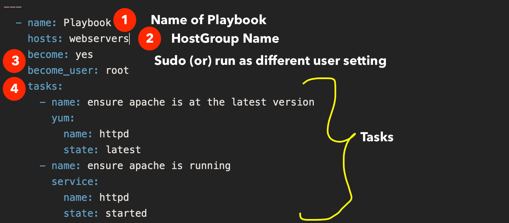

# Overview of Ansible Playbooks

Ansible Playbooks serve as the primary means to orchestrate and automate tasks across multiple hosts. They are written in YAML format and allow you to define sequences of actions, known as plays, to be executed on hosts defined in your inventory.





1. Definition and Structure:
   
   - `YAML Format:` Playbooks are written in YAML, a human-readable data serialization standard.
   - `Play:` A play is a section within a playbook that defines tasks to be executed on hosts. Each play is a dictionary with properties like `name`, `hosts`, and `tasks`.
   - `Task:` Tasks within a play define individual actions to be performed, such as executing commands, installing packages, or managing services.

2. Hosts and Groups:

    `Hosts Parameter`: Specifies on which host or group of hosts the tasks will be executed (hosts: localhost in the example).
    `Inventory Integration`: Hosts and groups must be defined in the Ansible inventory file. The playbook references these definitions to determine where to execute tasks.
    
3. Modules:

    `Definition`: Actions performed by tasks are executed using Ansible modules (`command`, `script`, `yum`, `service` in the example).
    `Module Types`: Ansible provides numerous built-in modules for different tasks such as package management, file operations, system administration, and more.
    `Documentation`: Detailed information about modules is available in the Ansible documentation or via the ansible-doc command.

Executing Playbooks:

`Command`: To run a playbook, use the ansible-playbook command followed by the playbook filename (`ansible-playbook playbook.yml`).
Parameters: Additional parameters can be passed to ansible-playbook to control playbook execution, such as specifying variables (--extra-vars) or limiting execution (--limit).

```yaml
   ---
   - name: Play 1
     hosts: localhost
     tasks:
       - name: Print current date
         command: date
       - name: Run a script
         script: /path/to/script.sh
       - name: Install Apache HTTP Server
         yum:
           name: httpd
           state: present
       - name: Start Apache service
         service:
           name: httpd
           state: started
```

`Multiple Plays:` Playbooks can contain multiple plays, each targeting different hosts or groups of hosts.
`Task Order:` The order of tasks within a play matters since tasks are executed sequentially. YAML's list structure (`-`) ensures tasks are executed in the specified order.

## Verifying Ansible playbooks

Verifying Ansible playbooks before executing them in a production environment is crucial to avoid unintended consequences and ensure smooth operations. Here are key reasons and methods for verifying playbooks:


1. `Enhance Stability and Reliability`: By running playbooks in check mode (`--check`), you simulate changes without actually applying them. This ensures that the playbook behaves as expected without disrupting services. For example, running `ansible-playbook install_nginx.yml --check` confirms what changes will occur, such as installing nginx, without modifying the system.

```bash
    ansible-playbook update_nginx.yml --check
```

2. `Utilize Diff Mode for Clarity`: When combined with check mode (`--diff`), diff mode shows the before and after states of system configurations. This visual comparison helps in understanding the exact modifications a playbook will introduce. For example, `ansible-playbook configure-nginx.yml --check --diff` can reveal specific changes like additions to a configuration file.

```
ansible-playbook update_nginx.yml --check --diff
```

4. `Syntax Checking`: Ansible provides a syntax check mode (`--syntax-check`) to detect playbook syntax errors before execution. This ensures that basic errors like typos or missing punctuation are caught early on. For instance, running `ansible-playbook configure_nginx.yml --syntax-check` verifies syntax integrity and alerts to any syntax errors that need correction.

5. `Module Compatibility Awareness`: Not all Ansible modules support check mode. It's essential to be aware of module capabilities to understand if certain tasks will be skipped or executed differently in check mode.

```yaml
---
- hosts: web_servers
  tasks:
    - name: Ensure Nginx is installed and running
      yum:
        name: nginx
        state: present
      notify: restart nginx

    - name: Ensure custom configuration is applied
      template:
        src: nginx.conf.j2
        dest: /etc/nginx/nginx.conf
      notify: restart nginx

  handlers:
    - name: restart nginx
      service:
        name: nginx
        state: restarted
```

## Ansible Lint

Ansible Lint serves as a command-line tool that performs linting, checking for potential errors, bugs, stylistic inconsistencies, and suspicious constructs within your Ansible codebase. This tool acts like a knowledgeable mentor, providing critical insights and catching issues that might otherwise go unnoticed during playbook development.

Ansible Lint ensures code quality by detecting errors and stylistic inconsistencies in Ansible playbooks. It helps maintain uniformity across playbooks, making them easier to understand and maintain as infrastructure scales.

```bash
ansible-lint style_example.yaml
```

## Introduction to Conditionals

In Ansible, conditionals are used to control the execution of tasks based on specified conditions. These conditions can check variables, previous task results, or system properties like OS type.

1. Example 1: OS Family Based Installation:
  - **Objective:** Create a playbook that installs NGINX using the appropriate package manager based on the OS flavor.
  - **Condition:** Use `ansible_os_family` variable to distinguish between Debian (APT) and Red Hat (Yum) systems.
  - **Implementation:** Use `when` conditional statement to selectively run tasks based on the OS family.
    
  ```yaml
  - name: Install NGINX
    become: yes
    yum:
      name: nginx
    when: ansible_os_family == 'RedHat'
  
  - name: Install NGINX
    become: yes
    apt:
      name: nginx
    when: ansible_os_family == 'Debian'
  ```

2. Example 2: Conditional in a Loop:**
   - **Objective:** Install a list of packages where `required` is `true`.
   - **Condition:** Check each package's `required` property in a loop.
   - **Implementation:** Use the `loop` directive with `when` conditional inside the loop.

  ```yaml
  - name: Install required packages
    become: yes
    package:
      name: "{{ item.name }}"
      state: present
    loop: "{{ packages }}"
    when: item.required == true
  ```

3. Example 3: Using Previous Task Output:**
   - **Objective:** Send an email if a service is not down.
   - **Condition:** Check the output of a previous task for specific content.
   - **Implementation:** Use `register` to capture task output and `when` with a condition based on the output.

  ```yaml
  - name: Check service status
    command: systemctl status myservice
    register: result
  
  - name: Send email if service is not down
    mail:
      to: admin@example.com
      subject: Service Status Alert
      body: Service is not down.
    when: result.stdout.find('down') == -1
  ```

`Key Points`

   - Use `when` with double equals (`==`) for equality checks.
   - Combine conditions using logical operators (`and`, `or`).
   - Utilize `ansible_*` variables to access system information.
   - Apply conditionals in loops (`loop` directive) to handle multiple items.
   - Check task output using `register` and `when` to create conditional workflows based on task results.


### Introduction to Ansible Facts

Ansible facts are system-specific variables collected during playbook execution, providing essential information about servers.

Scenario 1: Installing NGINX on Ubuntu 18.04:

   - **Objective:** Deploy a specific version of NGINX on servers running Ubuntu 18.04.
   - **Condition:** Utilize `ansible_facts` such as `os_family` and `distribution_major_version` to identify the operating system and version.
   - **Implementation:** Use `when` conditionals to ensure NGINX installation only on Ubuntu 18.04 servers.

```yaml
  - name: Install NGINX on Ubuntu 18.04
    become: yes
    apt:
      name: nginx=1.18.0
    when: ansible_facts['os_family'] == 'Debian' and ansible_facts['distribution_major_version'] == '18'
```

Scenario 2: Environment-based Configuration:

   - **Objective:** Deploy configuration files based on different environments (development, staging, production).
   - **Condition:** Define a variable (`app_env`) to specify the environment and use it in conditional statements.
   - **Implementation:** Conditionally include configuration tasks based on the `app_env` variable.
 
```yaml
  - name: Deploy configuration based on environment
    template:
      src: "{{ app_env }}/config.conf.j2"
      dest: "/etc/myapp/config.conf"
    when: app_env in ['development', 'staging', 'production']
```

Scenario 3: Conditional Task Execution:

   - **Objective:** Execute common tasks across all servers but start the web application service only on servers in the production environment.
   - **Condition:** Define an `environment` variable and use it to conditionally start the service.
   - **Implementation:** Include tasks common to all environments, and conditionally start the service based on the `environment` variable.

```yaml
  - name: Start web application service in production environment
    systemd:
      name: myapp
      state: started
    when: environment == 'production'
```

Key Points:

   - **Use of Facts:** `ansible_facts` provide crucial server information like OS type and version.
   - **Variable Usage:** Define and leverage variables (`app_env`, `environment`) to conditionally execute tasks.
   - **Conditional Statements:** Employ `when` conditionals to control task execution based on specific conditions.
   - **Flexibility and Efficiency:** Ansible's conditionals enable precise task management, making playbooks adaptable to diverse environments and requirements.

## Ansible Loops

Loops in Ansible allow executing tasks iteratively, reducing redundancy and making playbooks more efficient.

```yaml
- name: Create users
  user:
    name: "{{ item }}"
    state: present
  loop:
    - Joe
    - George
    - Ravi
```

AND

```yml
- name: Create users with ID
  user:
    name: "{{ item.name }}"
    uid: "{{ item.uid }}"
    state: present
  loop:
    - { name: Joe, uid: 1001 }
    - { name: George, uid: 1002 }
    - { name: Ravi, uid: 1003 }

```