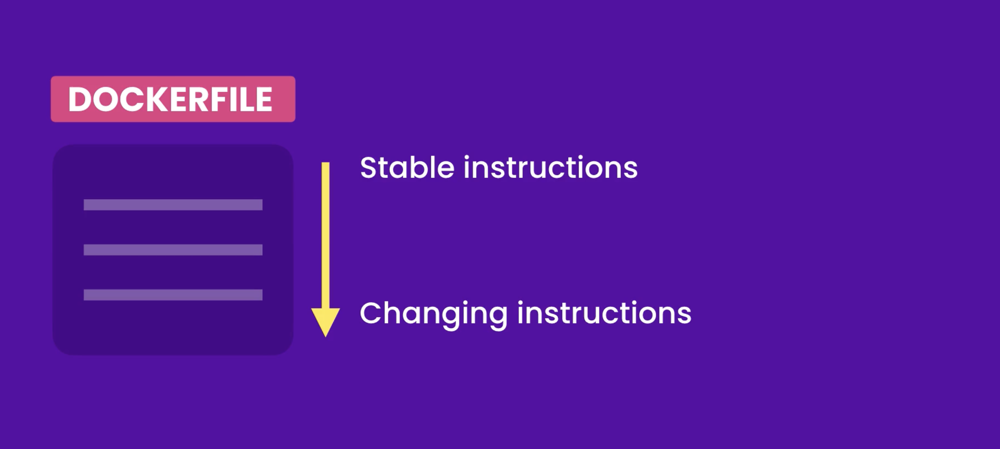

# Docker File

A Dockerfile is a text document that contains all the commands a user could call on the command line to assemble an image. It starts with a base image and then adds layers to configure and customize the environment where your application will run. Here's a basic structure of a Dockerfile and some key instructions you might use:

```
    # Use an official base image
    FROM ubuntu:20.04

    # Set the working directory in the container
    WORKDIR /app

    # Copy the current directory contents into the container at /app
    COPY . /app

    # Install dependencies (if any)
    RUN apt-get update && apt-get install -y \
        package1 \
        package2 \
        && rm -rf /var/lib/apt/lists/*

    # Specify environment variables
    ENV ENV_VAR_NAME=value

    # Expose ports (if your app listens on ports)
    EXPOSE 8080

    # Define the command to run your application
    CMD ["executable", " ", "param2"]
```

## Explanation of Instructions:

`FROM`: Specifies the base image to start building upon. In this example, `ubuntu:20.04` is used. It can be a OS or a runtime environment like node. (!IMP: can be image or URL)

`WORKDIR`: Sets the working directory for subsequent instructions. All paths in subsequent `COPY`, `RUN`, `CMD`, and    'ENTRYPOINT' instructions are relative to this path.

`COPY`: Copies files or directories from the host filesystem into the Docker image.

`RUN`: 1. Executes commands in a new layer on top of the current image and commits the results. 2. This is often used for installing packages and dependencies.

`ENV`: Sets environment variables.

`EXPOSE`: Informs Docker that the container listens on the specified network ports at runtime. It does not actually publish the port.

`CMD`: Provides defaults for an executing container. This is where you specify the command to run your application.

## Additional Instructions:

`ENTRYPOINT`: Configures a container that will run as an executable.
`VOLUME`: Creates a mount point with the specified path and marks it as holding externally mounted volumes from native host or other containers.

## Best Practices:

`Keep layers efficient`: Minimize the number of layers by combining commands and cleaning up unnecessary files.
`Use `.dockerignore``: List files and directories to exclude from the `COPY`context to keep the image small.
`Choose the right base image`: Use slim versions of base images to reduce image size and attack surface.

This basic structure can be expanded and customized based on your specific application's needs. Each instruction contributes to building a reproducible and scalable Docker image for your application.

----------------------

## ADD vs COPY

In the context of Dockerfiles, `ADD` and `COPY` are both Dockerfile instructions used to copy files and directories into a Docker image, but they have some key differences:

1. COPY:
   - Syntax: `COPY <src>... <dest>`
   - Copies files or directories from the host machine (where the Docker build command is executed) to the filesystem of the Docker image.
   - It is recommended to use `COPY` when you simply want to copy files or directories into the image without any processing.

2. ADD:
   - Syntax: `ADD <src>... <dest>`
   - Similar to `COPY`, `ADD` also copies files and directories from the host machine into the Docker image.
   - Additionally, `ADD` has some extra features:
     - It can handle URLs as `<src>`, which `COPY` cannot do.
     - It can also automatically extract tar files (`.tar`, `.tar.gz`, `.tgz`, `.tar.bz2`, `.tbz2`, `.tar.xz`, `.txz`) into the destination directory.
   - Because of these additional features, unless you specifically need them, it's generally recommended to use `COPY` over `ADD` for straightforward file copying, to avoid unintended behaviors (like URL fetching and extraction) that might complicate the build process.

## Best Practices:

Use `COPY` for straightforward file copying: If you just need to copy local files or directories into your Docker image, `COPY` is the simpler and safer choice.

Use `ADD` sparingly and only when needed: If you need to fetch files from URLs or automatically extract compressed archives during the build process, then `ADD` might be suitable.

## Example Usage:

```
# Using COPY
COPY ./app /app
```

```
# Using ADD (with caution)
ADD https://example.com/file.tar.gz /temp/
```

NOTE: In summary, while both `COPY` and `ADD` can copy files into a Docker image, `COPY` is generally preferred for its simplicity and clarity, unless `ADD`'s additional functionalities are specifically required.


----------------------

# CMD vs COPY

In the context of Docker, `CMD` and `RUN` are both instructions used in Dockerfiles, but they serve different purposes:

## RUN:

The `RUN` instruction is used to execute commands `during the build process` of the Docker image.

- Syntax: `RUN <command>`
- Example: `RUN apt-get update && apt-get install -y python3`

When you use `RUN`, Docker executes the specified command(s) in a new layer on top of the current image and commits the results. These results become part of the image and can be used in subsequent steps of the Dockerfile.

### CMD:

The `CMD` instruction is used to provide default command and/or parameters for executing the container.

- Syntax:
  - `CMD ["executable","param1","param2"]` (exec form)
  - `CMD command param1 param2` (shell form)
- Example: `CMD ["python3", "app.py"]` or `CMD python3 app.py`

`CMD` sets the command that will be run when a container is started from the Docker image. It is typically used to specify what command should be run to start an application inside the container.

### Key Differences:

**Purpose**: `RUN` is used to execute commands during the build phase to modify the Docker image itself (e.g., installing software, configuring environment), while `CMD` is used to specify the command that should be executed when a container is started.
  
**Execution Time**: `RUN` commands are executed during the Docker image build process (`docker build`), while `CMD` commands are executed when the container starts (`docker run`).

**Usage**: You can have multiple `RUN` instructions in a Dockerfile to build up the image step by step, while there can only be one `CMD` instruction. If multiple `CMD` instructions are provided, only the last one will take effect.

### Example Scenario:

Consider a Dockerfile for a Python application:

```dockerfile
    # Use a base image
    FROM python:3.9-slim

    # Set working directory
    WORKDIR /app

    # Install dependencies (using RUN)
    RUN apt-get update && apt-get install -y \
        python3-dev \
        libssl-dev \
        && pip install --upgrade pip

    # Copy application files (using COPY)
    COPY . .

    # Specify default command to run the application (using CMD)
    CMD ["python3", "app.py"]
```

In this example:
- `RUN` is used to update package repositories and install necessary dependencies during the image build process.
- `CMD` is used to specify that when a container is started, it should execute `python3 app.py` to run the Python application.

By understanding the differences between `RUN` and `CMD`, you can effectively use Dockerfiles to build images that correctly encapsulate and execute your applications within containers.

---------------------

#  Shell Form vs Exec Form

In Docker, when defining commands in Dockerfiles for instructions like `CMD` and `ENTRYPOINT`, you have the choice between using **shell form** and **exec form**. Here’s an explanation of each:

## Shell Form:

- **Syntax**: `CMD command param1 param2`
- **Example**: `CMD python3 app.py`


## Exec Form:
- **Syntax**: `CMD ["executable","param1","param2"]`
- **Example**: `CMD ["python3", "app.py"]`


### Key Differences:

**Interpretation**: Shell form commands are interpreted by `/bin/sh -c` (or equivalent) in the container, allowing for shell features like variable expansion (`$VAR`) and redirection (`>`). Exec form commands are executed directly without interpretation by a shell, which avoids overhead and potential pitfalls of shell processing.
  
**Quoting**: Shell form commands are subject to interpretation by the shell, which means you need to carefully handle quoting and escaping to ensure the command executes as intended. Exec form commands, being JSON arrays, do not require quoting or escaping beyond standard JSON rules.


### Example:

Here's how you might use both forms in a Dockerfile:

```dockerfile
# Shell form example
CMD python3 app.py
```

```dockerfile
# Exec form example
CMD ["python3", "app.py"]
```

In both cases, when a container is started from the resulting image:
- With shell form, Docker will execute `/bin/sh -c 'python3 app.py'`.
- With exec form, Docker will execute `python3 app.py` directly.

### Recommendation:

- **Prefer Exec Form**: Unless you specifically need shell features (like variable expansion or redirection), it's generally better to use exec form (`CMD ["executable","param1","param2"]`). This ensures consistent behavior across different environments and avoids potential security issues or bugs related to shell interpretation.


-------------------------------

# CMD vs ENTRYPOINT

In Docker, both `CMD` and `ENTRYPOINT` are instructions used in Dockerfiles to specify what command should be run when a container is started. They serve similar purposes but have distinct differences:

## CMD:

Purpose: `CMD` is used to provide default arguments for the command that is run when a container is started from the Docker image.

- **Syntax**:
  - Shell form: `CMD command param1 param2`
  - Exec form: `CMD ["executable","param1","param2"]`
  
- **Example**:
  - Shell form: `CMD python3 app.py`
  - Exec form: `CMD ["python3", "app.py"]`

- **Behavior**:
  - If `CMD` is specified multiple times in a Dockerfile, only the last one takes effect.
  - It can be overridden at runtime by providing arguments to `docker run`, which will replace the default command specified in `CMD`.

## ENTRYPOINT:

Purpose: `ENTRYPOINT` is used to configure a container that will run as an executable.

- **Syntax**:
  - Shell form: `ENTRYPOINT command param1 param2`
  - Exec form: `ENTRYPOINT ["executable","param1","param2"]`

- **Example**:
  - Shell form: `ENTRYPOINT python3 app.py`
  - Exec form: `ENTRYPOINT ["python3", "app.py"]`

- **Behavior**:
  - Unlike `CMD`, `ENTRYPOINT` does not get overridden when `docker run` provides command-line arguments. Instead, these arguments are passed as arguments to the `ENTRYPOINT` command.

### Key Differences:

1. **Override Behavior**:
   - `CMD` provides default arguments that can be overwritten by command-line arguments to `docker run`.
   - `ENTRYPOINT` sets the main command and arguments passed to `docker run` are appended to the end of the `ENTRYPOINT` command.

2. **Flexibility**:
   - `CMD` is typically used to specify the main command of the container, which can be overridden easily.
   - `ENTRYPOINT` is used to specify the main executable of the container, providing more control over how the container runs and less susceptibility to being overridden.

### When to Use Each:

- **CMD**: Use `CMD` when you want to provide default command-line arguments that can be easily overridden at runtime. It's useful for specifying the main operational command of the container, but you expect users might want to run variations of that command.
  
- **ENTRYPOINT**: Use `ENTRYPOINT` when you want to enforce a specific executable to run every time the container starts, with arguments provided as additional parameters. It's useful when you want the container to behave like an executable with fixed behavior that users can't easily change.

### Example Dockerfile Usage:

```dockerfile
# Using CMD (exec form)
CMD ["python3", "app.py"]
```

```dockerfile
# Using ENTRYPOINT (exec form)
ENTRYPOINT ["python3", "app.py"]
```

In the above examples:
- With `CMD`, users can override `app.py` with another script or command when running the container.
- With `ENTRYPOINT`, `app.py` is always executed as the main command of the container, and additional arguments passed to `docker run` are treated as arguments to `app.py`.

