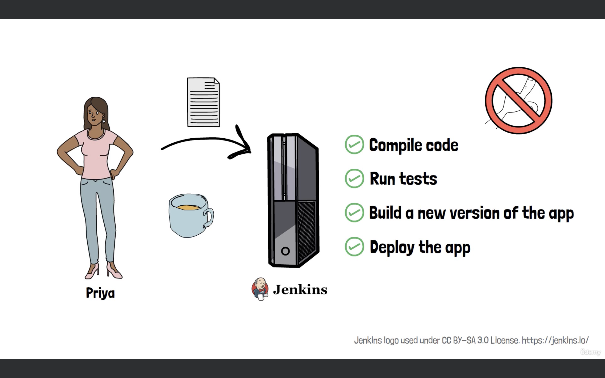
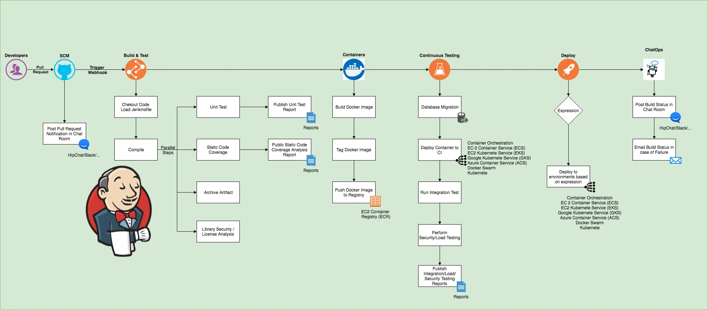
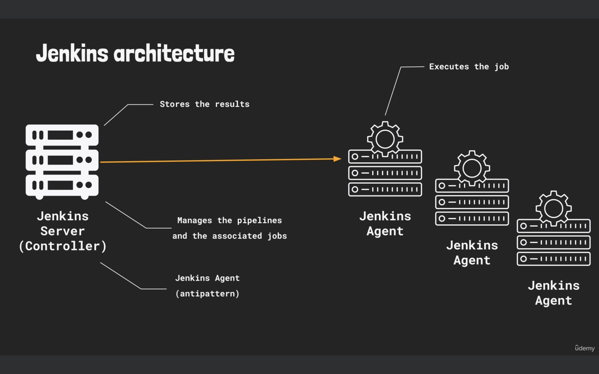

# Jenkins

Jenkins is a free and open-source automation server designed to help with the building, testing, and deployment of software. Think of Jenkins as a robot assistant that takes over the routine tasks in the software development process.

Jenkins can automatically:

    - Compile the software to check for any errors.
    - Run Tests to ensure that everything works as it should.
    - Package the software into a ready-to-use version.
    - Deploy the new version to a web server for users to access.

Using Jenkins helps team catch issues early, keep the software in a good state, and automate many repetitive tasks. This not only improves efficiency but also makes the development process more enjoyable.

NOTE: In technical terms, Jenkins is a tool for Continuous Integration (CI) and Continuous Deployment (CD). It’s all about automation and making repetitive tasks easier and more reliable.



------

Historical Context: The Evolution of Jenkins Jobs

1.Freestyle Jobs: The Original Approach

Freestyle jobs in Jenkins do not support the "pipeline as code" principle, which leads to significant challenges in modern CI/CD practices. Since configurations in freestyle jobs are done via the Jenkins UI and are not version-controlled, it becomes difficult to track, review, or revert changes, undermining best practices in DevOps that emphasize automation, version control, and repeatability. Additionally, setting up complex workflows with freestyle jobs often requires extensive use of plugins, resulting in fragmented and hard-to-manage setups.

Use Case: Freestyle Jobs were simple to use and suitable for straightforward tasks where you needed to run a series of commands or scripts.

2. Pipeline Jobs

Pipeline Jobs in Jenkins are designed to handle complex CI/CD workflows through a code-based configuration approach. By defining the entire build process as code, Pipeline Jobs offer numerous advantages such as version control, flexibility, and maintainability. The Pipeline architecture consists of defining stages and steps in a Jenkinsfile, which the Controller manages and schedules while the Agents execute the tasks. There are two main types of Pipelines: Declarative and Scripted, each suited for different levels of complexity and control.



NOTE: A freestyle job uses the Jenkins graphical user interface for configurations, while a pipeline job primarily uses a script in the pipeline section.


## What Happens Behind the Scenes When Running a Jenkins Job?

When you run a Jenkins job, the process involves a collaboration between two main components of Jenkins architecture:
 `the Jenkins Controller` and `Jenkins Agents`. 
 
 The Jenkins Controller (also known as the Master) is responsible for managing job configurations, scheduling builds, and tracking results. When a job is triggered, the Controller determines which Agent will execute the job based on the job’s requirements and available resources. The selected Jenkins Agent (also known as a Node) receives the job instructions from the Controller, executes the specified commands, and then reports the results back to the Controller. The Controller processes the results, updates the job status, and displays the build information on the Jenkins dashboard for the user to review. 
 
 NOTE: In a basic setup, the same instance may act as both the Controller and the Agent, but in production environments, they are typically separated to prevent the Controller from being overwhelmed with work. Multiple Agents can be used to distribute the load and run jobs in parallel, allowing for more scalable and efficient build processes. This separation of concerns ensures that the Controller handles management tasks while the Agents focus on executing the actual work, reflecting the principle that the Controller manages the job, while the Agent performs the job.




NOTE: Controller: To manage the execution of the pipeline, delegating actual job execution to agents. Agent: It retrieves instructions from the Jenkins controller, executes job stages, and reports the results back.


-------------

##  Manage Workspace Cleanup in a Jenkins Pipeline

In a Jenkins pipeline, managing the workspace effectively is crucial for maintaining clean builds and preventing issues with stale files. In Jenkins, each build job has a workspace that stores the files required for the build process. By default, Jenkins will reuse the workspace from previous builds unless explicitly instructed otherwise. This can lead to problems where leftover files from previous builds interfere with new ones.


For instance, in the "laptop assembly" example, you may end up with a `computer.txt` file that retains data from previous builds, resulting in multiple entries for components like the mainboard or keyboard.

To ensure that each build starts with a clean slate, you can configure your Jenkins pipeline to automatically clean up the workspace after each build.


### Adding `cleanWs` to the Pipeline Script

The `cleanWs` step is a Jenkins Pipeline Utility Plugin feature that clears the workspace. You can include it in the `post` block to ensure the workspace is cleaned up after the build completes.

Pipeline Script with `cleanWs`

```groovy
pipeline {
    agent any

    stages {
        stage('Build') {
            steps {
                echo 'Building a new laptop'
                sh 'mkdir -p build'  // Create a build directory, using -p to avoid errors if it already exists
                sh 'touch build/computer.txt'  // Create a new file in the build directory
                sh 'echo "Mainboard" >> build/computer.txt'  // Add text to the file
            }
        }

        stage('Add Mainboard') {
            steps {
                echo 'Adding Mainboard'
                sh 'echo "Mainboard" >> build/computer.txt'  // Append text to the file
                sh 'cat build/computer.txt'  // Display the file contents for verification
            }
        }

        stage('Add Display') {
            steps {
                echo 'Adding Display'
                sh 'echo "Display" >> build/computer.txt'
                sh 'cat build/computer.txt'
            }
        }

        stage('Add Keyboard') {
            steps {
                echo 'Adding Keyboard'
                sh 'echo "Keyboard" >> build/computer.txt'
                sh 'cat build/computer.txt'
            }
        }

        stage('Deploy') {
            steps {
                echo 'Deploying Laptop'
                echo 'Packaging the laptop into a box'
                echo 'Shipping the laptop to customers'
            }
        }
    }

    post {
        always {
            cleanWs()  // Clean up the workspace after the build
        }
    }
}
```
----

`cleanWs()`: This step will delete all files and directories in the workspace, ensuring that each build starts with a fresh environment.

After adding `cleanWs()` to your pipeline, you should observe the following:

1. Build Proces: The build will execute as usual, but now at the end of the build process, Jenkins will clean up the workspace.

2. Workspace Verificatio: Check the console output of your build job to confirm that the workspace was cleaned. You should see a message indicating the workspace was deleted.

Console Output Example

   ```groovy
   [workspace] $ /bin/sh -c 'rm -rf *'
   ```

Workspace Tab
   - After the build, the `Workspace` tab will show that there are no files or directories left.

## Alternate Methods for Workspace Management

If you prefer not to use `cleanWs()`, there are other ways to manage workspace cleanliness:

1. Manually Cleaning Workspace

You could manually delete files or directories at the beginning of the pipeline, but this is less automated and generally less recommended.

```groovy
pipeline {
    agent any

    stages {
        stage('Clean Workspace') {
            steps {
                sh 'rm -rf build' # delete files before every job
            }
        }

        stage('Build') {
            steps {
                echo 'Building a new laptop'
                sh 'mkdir -p build'
                sh 'touch build/computer.txt'
                sh 'echo "Mainboard" >> build/computer.txt'
            }
        }
        // ... Other stages as before ...
    }
}
```

2. Advanced Cleanup Techniques

For more advanced cleanup or conditional cleanup, you might use Groovy scripts or other Jenkins plugins.

```groovy
post {
    always {
        script {
            def wsDir = new File("${JENKINS_HOME}/workspace/${JOB_NAME}")
            wsDir.eachFileRecurse(groovy.io.FileType.FILES) { file ->
                if (file.name.endsWith('.log')) {
                    file.delete()
                }
            }
            wsDir.deleteDir()
        }
    }
}
```

This script could be added to the `post` block to selectively delete files based on certain conditions.

---

## How to Manage Artifacts and Workspace Cleanup in a Jenkins Pipeline

In Jenkins pipelines, managing artifacts and workspace cleanup effectively is key to maintaining a clean build environment and ensuring that important files are preserved for later use. In a Jenkins pipeline, the goal is to build something and then keep certain files (artifacts) for future reference or use, while also ensuring that the workspace is cleaned up afterward. The challenge is to manage this process in a way that doesn’t lead to the deletion of important files before they are archived.

NOTE: run `cleanWs()`  before every build

```groovy
pipeline {
    agent any

    stages {
        stage('Build') {
            steps {
                cleanWs() 
                echo 'Building a new laptop'
                sh 'mkdir -p build'  // Create the build directory
                sh 'touch build/computer.txt'  // Create the computer.txt file
                sh 'echo "Mainboard" >> build/computer.txt'  // Add Mainboard
            }
        }
    }
    post {
        success {
            archiveArtifacts artifacts: 'build/', allowEmptyArchive: true  // Archive the build directory and its contents
        }
    }
}
```

--------

### Improved Example with test stage
```groovy
pipeline {
    agent any

    stages {
        stage('Build') {
            steps {
                cleanWs()
                echo 'Building a new laptop'
                sh '''
                    mkdir -p build
                    echo "Mainboard" > build/computer.txt
                '''
            }
        }

        stage('Add Components') {
            steps {
                script {
                    def components = ['Mainboard', 'Display', 'Keyboard']
                    for (component in components) {
                        echo "Adding ${component}"
                        sh "echo \"${component}\" >> build/computer.txt"
                    }
                }
                sh 'cat build/computer.txt'
            }
        }

        stage('Test') {
            steps {
                echo 'Testing the new laptop build'
                sh '''
                    # Check if the file exists
                    if [ -f build/computer.txt ]; then
                        echo "File build/computer.txt exists"
                    else
                        echo "File build/computer.txt does not exist"
                        exit 1
                    fi

                    # Check if the file contains all required components
                    required_components="Mainboard Display Keyboard"
                    for component in $required_components; do
                        if grep -q "$component" build/computer.txt; then
                            echo "$component found in build/computer.txt"
                        else
                            echo "$component not found in build/computer.txt"
                            exit 1
                        fi
                    done
                '''
            }
        }

        stage('Deploy') {
            steps {
                echo 'Deploying Laptop'
                echo 'Packaging the laptop into a box'
                echo 'Shipping the laptop to customers'
            }
        }
    }

    post {
        success {
            archiveArtifacts artifacts: 'build/', allowEmptyArchive: true  // Archive the build directory
        }
    }
}

```

-----

## Pipeline Configurations with Variables in Jenkins

By defining and using variables in  Jenkins pipeline, we can manage configurations more efficiently and avoid errors caused by manual changes. This practice not only reduces duplication but also makes future updates easier.


1. Defining Variables

In Jenkins pipelines, you can define global variables to avoid repetition and make the script easier to maintain. To define a variable, you use the `environment` block within your pipeline configuration:

```groovy
pipeline {
    agent any
    environment {
        BUILD_FILE_NAME = 'laptop.txt'
    }
    stages {
        stage('Build') {
            steps {
                echo "Using file: ${BUILD_FILE_NAME}"
                sh 'cat ${BUILD_FILE_NAME}'
            }
        }
        // Other stages
    }
}
```

Explanation:
- `environment` Block: This is where you define variables. Use uppercase names with underscores for readability.
- `BUILD_FILE_NAME = 'laptop.txt'`: Defines a variable `BUILD_FILE_NAME` with the value `'laptop.txt'`.

2. Using Variables

Once a variable is defined, you can use it throughout the pipeline script. You reference a variable by prefixing it with `${}` in Groovy syntax:

```groovy
echo "Using file: ${BUILD_FILE_NAME}"
sh 'cat ${BUILD_FILE_NAME}'
```

Important Notes:
- Double Quotes: Use double quotes to allow variable interpolation.
- Single Quotes: Single quotes treat the string literally, without variable substitution.


---

Your recap covers the essentials of what has been discussed so far regarding Jenkins, Linux commands, and DevOps practices. Here’s a refined version of your recap, highlighting the main points and concepts:

---------------


## Summary

1. Types of Jenkins Jobs:
   - Freestyle Jobs: Basic, GUI-based jobs for simple tasks.
   - Pipeline Jobs: Advanced jobs using code-based configurations for complex workflows, aligning with modern best practices.

2. Benefits of Pipeline Jobs:
   - Preferred in modern Jenkins implementations for their flexibility and scalability.

3. Linux Commands:
   - `echo`: Print text or display variable values.
   - `mkdir`: Create new directories.
   - `touch`: Update file timestamps or create new files.
   - `rm`: Remove files or directories.
   - `sleep`: Pause execution for a specified duration.
   - `cat`: Display file contents.
   - `test`: Check for file existence or other conditions.
   - `grep`: Search for specific strings in files.

4. Jenkins Pipeline Execution:
   - Logs are crucial for understanding pipeline execution and troubleshooting.
   - Exit Codes: Indicate whether commands executed successfully (0 for success, non-zero for errors).

5. DevOps Philosophy:
   - Not Just Tools: DevOps is about practices and methodologies for building and deploying software efficiently.
   - Tools as Enablers: Tools like Jenkins support DevOps practices but don’t define them.

