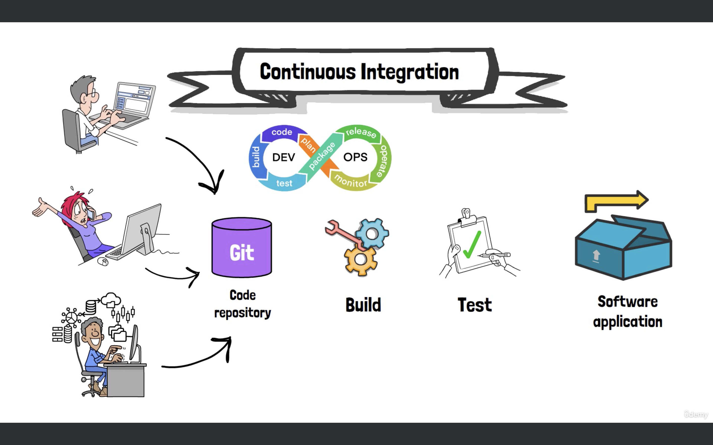
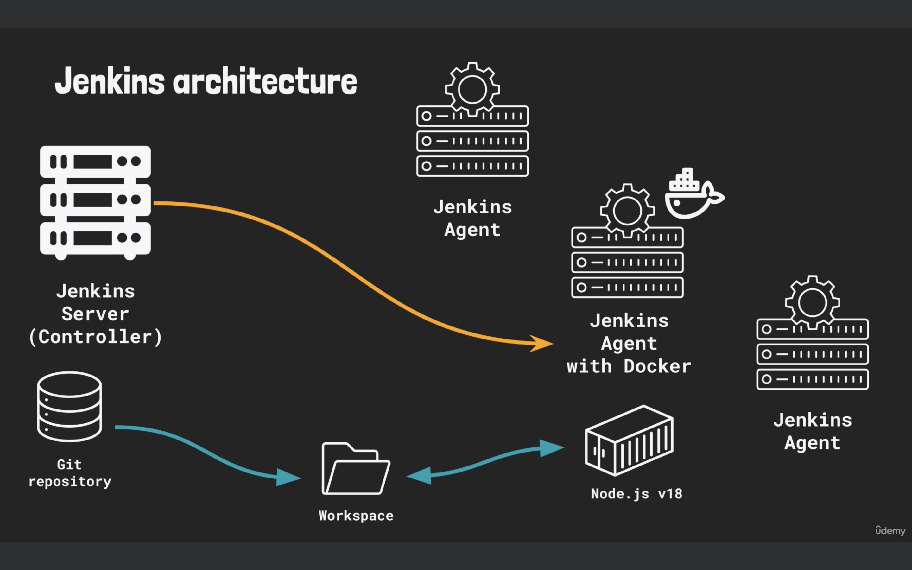

# Continuous Integration (CI)

Continuous Integration (CI) is a development practice where code changes are integrated into a shared repository frequently—often multiple times a day. The core idea is to keep the codebase in a deployable state at all times, reducing integration issues and improving collaboration among developers.

Here’s a quick breakdown of what CI involves:

    - `Frequent Integration`: Developers merge their code changes into a shared repository multiple times a day.
    - `Automated Builds and Tests`: Each integration triggers an automated build process followed by tests to verify that the changes don't break the software.
    - `Early Issue Detection`: By integrating frequently, issues are detected early, which is easier and less costly to fix compared to addressing them later.
    - `Version Control Systems`: Tools like Git help manage and track changes, making it easier to collaborate on the same codebase.



Tools for Continuous Integration

1. Git: A version control system that tracks code changes and manages collaborative work. If you are unfamiliar with Git, there is a quick introduction available in the resources folder.

2. Jenkins: An open-source automation server used to set up CI pipelines. Jenkins will help automate the build, test, and deployment processes.


-------------------


## Understanding Workspaces in Jenkins Pipelines with and without Docker (Agent)

In Jenkins pipelines, understanding how workspaces function with and without Docker is crucial for effective job management.

1. Pipeline Without Docker

In a Jenkins pipeline stage that does not use Docker, the following occurs:

1. `Agent Selection`:
   The Jenkins controller selects an appropriate agent where the job will run.

2. `Command Execution`:
   Commands are executed directly on the agent's filesystem.

3. `Workspace`:
   - `Definition`: The workspace is a directory on the agent where Jenkins stores files related to the job.
   - `Location`: Typically, the workspace is located at `<JENKINS_HOME>/workspace/<JOB_NAME>`.


   ```groovy
   stage('Without Docker') {
       steps {
           echo 'Running without Docker'
           sh '''
               # List files in the current workspace
               ls -la
               # Create a file in the workspace
               touch container_no.txt
           '''
       }
   }
   ```

   `Expected Workspace Behavior`:
   - Commands run directly on the agent’s workspace.
   - Files created during the job are persistent in the workspace for the duration of the job.

   `Logs Example`:
   ```groovy
   Running on Jenkins
   Workspace location: /var/jenkins_home/workspace/test-space-npm
   Files in the workspace:
   container_no.txt
   ```

2. Pipeline With Docker

When Docker is involved, the Jenkins job behaves differently:

1. `Agent Selection`:
   The Jenkins controller selects an agent that supports Docker.

2. `Docker Container Management`:
   - `Image Handling`: The specified Docker image is pulled if it’s not already available.
   - `Container Execution`: A new Docker container is started based on the image.
   - `Command Execution`: Commands are executed inside the Docker container.
   - `Workspace`: Each Docker container has its own isolated workspace.

   `Example Commands`:

   ```groovy
   stage('With Docker') {
       agent {
           docker {
               image 'node:14'
           }
       }
       steps {
           echo 'Running with Docker'
           sh '''
               # List files in the current workspace
               ls -la
               # Create a file in the Docker container's workspace
               touch container_yes.txt
           '''
       }
   }
   ```

   `Expected Workspace Behavior`:
   - Commands run in the Docker container's own workspace.
   - The container's workspace is separate from the agent’s workspace, and files created in this stage are not available in subsequent stages unless configured for workspace reuse.

   `Logs Example`:
   ```
   Running with Docker
   Workspace location: /var/jenkins_home/workspace/test-space-npm-2
   Files in the workspace:
   container_yes.txt
   ```

3. Workspace Reuse Configuration

To ensure that stages using Docker share the same workspace as those that do not, you need to configure the `reusableNode` parameter. By default, Jenkins creates separate workspaces for Docker containers. To enable workspace sharing across stages, set `reuseNode` to `true`.

`How to Configure Workspace Reuse`:

```groovy
pipeline {
    agent none
    stages {
        stage('Without Docker') {
            agent {
                label 'my-agent'
            }
            steps {
                echo 'Running without Docker'
                sh '''
                    ls -la
                    touch container_no.txt
                '''
            }
        }
        stage('With Docker') {
            agent {
                docker {
                    image 'node:14'
                    reuseNode true
                }
            }
            steps {
                echo 'Running with Docker'
                sh '''
                    ls -la
                    touch container_yes.txt
                '''
            }
        }
    }
}
```

`Logs After Configuration`:
```groovy
    Running without Docker
    Workspace location: /var/jenkins_home/workspace/test-space-npm
    Files in the workspace:
    container_no.txt

    Running with Docker
    Workspace location: /var/jenkins_home/workspace/test-space-npm
    Files in the workspace:
    container_no.txt
    container_yes.txt
```


-----------------

# Revisit Jenkins architecture

Understanding Jenkins Architecture with Docker
 
;

1. Jenkins Pipeline Architecture Overview

   - Jenkins Controller (formerly Master): Manages Jenkins tasks and schedules jobs.
   - Jenkins Agent (formerly Slave): Executes jobs on behalf of the Jenkins Controller.
   - Docker Image: A blueprint for creating Docker containers, containing the necessary tools and environment for running the job.

Pipeline Steps:
1. Job Scheduling:
   The Jenkins Controller schedules a job and selects a suitable Agent to run it.

2. Cloning the Git Repository:
   The Controller clones the Git repository containing the Jenkinsfile and stores it in the Agent’s workspace.

3. Starting the Docker Container:
   The Agent starts the Docker container using the specified Docker image. The container’s workspace is linked to the Agent’s workspace.

4. Running the Pipeline Commands:
   Commands defined in the Jenkinsfile are executed inside the Docker container.

5. Stopping the Docker Container:
   After the commands are executed, the Docker container is stopped, and any temporary volumes created are removed.

6. Continuing the Pipeline:
   Jenkins proceeds to the next stage of the pipeline, if there is one.

---

2. Detailed Process Flow

Step 1: Job Scheduling and Agent Selection

When a Jenkins job is triggered, the Jenkins Controller selects an Agent based on the job’s requirements. 

Example Jenkinsfile:

```groovy
pipeline {
    agent {
        docker {
            image 'node:14'
        }
    }
    stages {
        stage('Build') {
            steps {
                echo 'Building the project'
                sh 'node --version'
            }
        }
    }
}
```

Step 2: Cloning the Git Repository

Before starting the Docker container, the Jenkins Controller clones the Git repository to the Agent’s workspace.

Log Output:

```
Cloning the Git repository...
[workspace] $ git clone -q https://github.com/user/repo.git
```

Step 3: Starting the Docker Container

The Agent starts a Docker container using the specified Docker image. The workspace directory on the Agent is mounted into the Docker container to ensure files are accessible to the container and any changes are reflected back to the workspace.

Log Output:

```
Starting Docker container...
docker run -t -d -v /var/jenkins_home/workspace/my-job:/workspace -w /workspace node:14
```

Commands:
- `-t`: Allocates a pseudo-TTY.
- `-d`: Runs the container in detached mode.
- `-v /var/jenkins_home/workspace/my-job:/workspace`: Maps the Jenkins workspace directory to `/workspace` in the container.
- `-w /workspace`: Sets the working directory in the container.

Step 4: Running the Pipeline Commands

Commands defined in the Jenkinsfile are executed inside the Docker container.

Log Output:

```
Running pipeline commands...
+ node --version
v14.17.6
```

Step 5: Stopping the Docker Container

After the pipeline commands are executed, the Docker container is stopped, and any temporary volumes created during the job are removed.

Log Output:

```bash
Stopping Docker container...
docker stop <container_id>
docker rm <container_id>
```

Step 6: Continuing the Pipeline

Jenkins proceeds to the next stage of the pipeline.

Log Output:

```
Pipeline stage completed. Moving to the next stage...
```

---

3. Workspace Mapping and File Synchronization

Why Workspace Mapping Matters:

- File Access: Ensures that the Docker container has access to files from the Jenkins workspace.
- File Persistence: Ensures that changes made within the Docker container are saved to the Jenkins workspace even after the container is stopped.

Example of Workspace Mapping:

```bash
Host (Agent) Workspace: /var/jenkins_home/workspace/my-job
Docker Container Workspace: /workspace
```

How to Verify File Synchronization

You can check that files are synchronized by adding commands in your Jenkinsfile to list files before and after running your build steps.

```groovy
pipeline {
    agent {
        docker {
            image 'node:14'
        }
    }
    stages {
        stage('Check Files') {
            steps {
                sh '''
                    echo "Files in the workspace before build:"
                    ls -la
                    echo "Creating a file..."
                    touch container_file.txt
                    echo "Files in the workspace after build:"
                    ls -la
                '''
            }
        }
    }
}
```

Log Output:

```bash
Files in the workspace before build:
total 8
drwxr-xr-x 2 root root 4096 Oct 12 13:37 .
drwxr-xr-x 1 root root 4096 Oct 12 13:37 ..
Files in the workspace after build:
total 12
drwxr-xr-x 2 root root 4096 Oct 12 13:38 .
drwxr-xr-x 1 root root 4096 Oct 12 13:37 ..
-rw-r--r-- 1 root root    0 Oct 12 13:38 container_file.txt
```

---

## 4. Diagram of the Jenkins and Docker Workflow

Here’s a visual representation of the Jenkins and Docker architecture:

Jenkins Pipeline Workflow

```bash
                                        +------------------+                       +---------------------+
                                        | Jenkins Controller|                    | Docker Image        |
                                        | - Schedules Jobs  |                    | - node:14           |
                                        | - Manages Agents  |                    | - Other Dependencies|
                                        +--------+---------+                       +---------+-----------+
                                                |                                          |
                                                |                                          |
                                                | Clones Git Repository                    |
                                                |                                          |
                                                v                                          v
                                        +--------+---------+                      +---------+--------------+
                                        |  Agent           |                      |  Docker Container      |
                                        | - Runs Commands  |                      | - Uses Docker Image    |
                                        | - Manages Workspace|                    | - Executes Commands    |
                                        +--------+---------+                      | - Maps Workspace       |
                                                |                                 | - Performs Build       |
                                                |                                 +--------+---------------+
                                                |                                          |
                                                |  Mounts Workspace                       |
                                                |                                          |
                                                |  and Runs Pipeline Commands            |
                                                |                                          |
                                                +--------->|----------------------------->+  
                                                |          |                            |
                                                |          v                            |
                                                |   +----->| Stop and Remove Container  |
                                                |   |      +----->| Sync Files to Workspace|
                                                v   v                                   v
                                        +--------+---------+                      +---------+-----------+
                                        |  Jenkins Controller|                  |   Workspace          |
                                        | - Continues Pipeline |               | - Accessible Files   |
                                        | - Manages Next Stages |               +----------------------+
                                        +------------------+

```

Jenkins Log Output Examples

1. Cloning the Repository:

    ```groovy
    [Pipeline] Checkout
    Cloning the Git repository...
    ```

2. Starting the Docker Container:

    ```groovy
    [Pipeline] {
    [Pipeline] sh
    + docker run -t -d -v /var/jenkins_home/workspace/my-job:/workspace -w /workspace node:14
    ```

3. Executing Commands in the Container:

    ```groovy
    [Pipeline] sh
    + node --version
    v14.17.6
    ```

4. Stopping the Docker Container:

    ```groovy
    [Pipeline] {
    [Pipeline] sh
    + docker stop <container_id>
    + docker rm <container_id>
    ```

5. Workspace File Synchronization:

    ```groovy
    Files in the workspace:
    - container_file.txt
    ```

5. Common Issues and Troubleshooting

Issue: Files created in the Docker container are missing after the job completes.
- Solution: Ensure that workspace mapping (`-v /var/jenkins_home/workspace/my-job:/workspace`) is correctly specified in the Docker command.

Issue: Docker commands fail or the Docker container doesn’t start.
- Solution: Check Docker daemon status and configuration on the Agent machine.

Issue: The pipeline does not proceed to the next stage.
- Solution: Verify that all stages and steps are properly defined in the Jenkinsfile and check for any errors in the logs.

---


Further Reading and Resources

- [Jenkins Documentation on Pipelines](https://www.jenkins.io/doc/book/pipeline/)
- [Docker Documentation](https://docs.docker.com/get-started/)
- [Jenkins Pipeline Syntax Reference](https://www.jenkins.io/doc/book/pipeline/syntax/)
- [Docker in Jenkins: Using Docker Containers](https://www.jenkins.io/doc/book/pipeline/docker/)
- [Jenkins Docker Pipeline Plugin](https://plugins.jenkins.io/docker-workflow/)

--------------------


# How to Publish a JUnit Test Report in Jenkins

 the steps required to publish a JUnit test report from Jenkins. We will cover what a JUnit test report is, how to configure Jenkins to process this report, and how to interpret the results. 
 
 
Let’s break this down step-by-step.

---

## What is a JUnit Test Report?

Definition:
A `JUnit test report` is a file generated by the JUnit testing framework used in Java projects. The file is usually in XML format and contains detailed information about the test execution results. 

Contents of a JUnit Report:
- `Pass or Fail Status`: Indicates if each test case passed or failed.
- `Execution Times`: Shows how long each test took to run.
- `Error Messages`: Provides details about any test failures or errors.
- `Other Statistics`: Includes additional metrics relevant to the test results.

Importance:
JUnit test reports are crucial for `Continuous Integration/Continuous Deployment (CI/CD)` pipelines as they:
  - Allow for automated review of test results.
  - Help identify failed tests and understand what went wrong.
  - Provide a historical view of test trends over time.

---

## Generating a JUnit Test Report

Even if your project does not use Java or the JUnit framework, many testing frameworks can generate reports in the JUnit XML format. 

Example:
When you run the `npm test` command in a JavaScript project, it executes your tests and also generates a JUnit-style XML report. This report is stored in a specific directory (usually named `test-results`).

`Example Path:` `test-results/JUnit.xml`

Sample JUnit XML Report:
```xml
<testsuites name="my-tests" tests="1" failures="0" errors="0" skipped="0" time="0.004">
  <testsuite name="my-test-suite" tests="1" failures="0" errors="0" skipped="0" time="0.004">
    <testcase name="my-test-case" classname="my-test-class" time="0.004"/>
  </testsuite>
</testsuites>
```

---

## Configuring Jenkins to Publish the JUnit Report

To configure Jenkins to read and display the JUnit report, you will modify your Jenkinsfile. This configuration is added to ensure that the test results are processed and shown regardless of whether the build succeeds or fails.

Steps to Configure Jenkins:

1. `Locate Your Jenkinsfile:`
   This file defines your pipeline and its stages.

2. `Add a Post Action:`
   Add a `post` section to your Jenkinsfile to specify actions that should occur after all stages complete.

   ```groovy
   pipeline {
       agent any
       stages {
           // Your stages go here
       }
       post {
           always {
               junit 'test-results/JUnit.xml'
           }
       }
   }
   ```

   - ``always``: Ensures the JUnit report is published regardless of the pipeline’s success or failure.
   - ``junit 'test-results/JUnit.xml'``: Specifies the path to the JUnit XML report.

   `Important:` Ensure that the path to the XML file is correct. A typo in the path will cause Jenkins to fail to find the report.

3. `Commit Changes:`
   Save the changes to your Jenkinsfile and commit them to your repository.

4. `Run the Pipeline:`
   Trigger the pipeline to execute the Jenkins job and process the test results.

Verifying the JUnit Report in Jenkins

1. `Check the Build Results:`
   After the build completes, navigate to the build summary page.

2. `Look for the Test Result Trend:`
   You should see a section called `"Test Result Trend"` which shows a graph of test results over time.

   - `No Failures:` If everything is successful, you’ll see that there are no failed tests.
   - `Click for Details:` Click on the test results to see details about each test case.

3. `Review Test Results:`
   You can click on `"Test Result"` to see detailed information about the tests, including which tests passed, failed, or were skipped.

   - `Test Case Details:` You can view individual test case results, including execution time and any errors.

Example of Jenkins Test Result Page:


---------------

# Running End-to-End Tests with Playwright in Jenkins: A Step-by-Step Guide

 we delve into the process of running end-to-end (E2E) tests using the Playwright framework within a Jenkins CI pipeline. End-to-end tests validate a fully operational version of our application, which in this case is a website. To effectively execute these tests, the application must be running, which we can achieve within Jenkins by modifying our pipeline configuration. Here's a detailed breakdown of the steps involved:

1. Build the Application:
   Begin by building the application using the command `npm run build`. This command compiles the source code into a deployable build folder. Upon successful execution, it indicates that the build is ready and provides instructions for serving it locally.

2. Install and Run a Local Server:
   To view the application locally, you need to install the `serve` package globally using `npm install -g serve`. This package enables you to start a simple HTTP server to serve the contents of the build directory. After installing `serve`, you can start the server with the command `serve -s build`. This command runs the server, which you can access through the provided local address.

3. Configure Jenkins Pipeline:
   Next, you must adapt the Jenkins pipeline to include the E2E testing stage. Since we do not yet have a deployed version of the application, we will start it within the Jenkins environment. Copy the existing test configuration to create a new `end-to-end` stage and update it to use the Playwright Docker image:
   ```yaml
   image: mcr.microsoft.com/playwright:latest
   ```
   In this configuration, you will need to install `serve` locally within the Docker container and run the server in the background. Use `npm install serve` to add `serve` to the project’s local dependencies, and modify the Jenkinsfile as follows:

   ```groovy
   stage('end-to-end') {
       steps {
           script {
               // Start the local server
               sh 'npx serve -s build &'
               // Wait for the server to start
               sleep(10)
               // Run Playwright tests
               sh 'npx playwright test'
           }
       }
   }
   ```

4. Handle the Server Process:
   Since the `serve` command runs indefinitely, append an ampersand (`&`) to start it in the background. Additionally, use the `sleep` command to introduce a delay, allowing the server to fully initialize before running the tests.

5. Resolve Issues with Permissions:
   If you encounter permissions errors due to trying to install `serve` globally, switch to installing it locally to avoid these issues. In the `package.json`, ensure that the `node_modules/.bin` directory is used to run `serve` instead of a global installation.

6. Configure Test Results:
   Ensure that the Playwright test results are saved and published correctly. Update the Playwright configuration file to define the output directory for test results:
   ```groovy
   "reporter": [["html", { "outputFolder": "results" }]]
   ```
   Adjust the Jenkinsfile to point to this directory:
   ```yaml
   post {
       always {
           junit 'results//*.xml'
       }
   }
   ```

7. Commit and Test:
   Commit the updated Jenkinsfile to your repository and trigger the pipeline. If the pipeline fails, review the logs to diagnose issues, such as the background process hanging or misconfigured paths.

8. Verify Pipeline Success:
   After adjustments, a successful pipeline run should show that the E2E tests executed and completed without errors. Verify that the `results` directory is created and the test results are available.

---------------

Great job outlining the steps to set up Playwright with Jenkins and publish an HTML report! Let's break this down into a more structured guide for better understanding and practical application.

---

# How to Generate and Publish an HTML Report for Playwright Tests in Jenkins

1. Run Playwright Tests with an HTML Reporter

To generate an HTML report from Playwright tests, you need to modify your `npx playwright test` command to include the HTML reporter. Add the `--reporter=html` flag to your command.

Example Command:
```bash
npx playwright test --reporter=html
```

2. Update the Jenkinsfile

Edit your `Jenkinsfile` to include the `--reporter=html` flag in the Playwright test command. Here’s how you can update the `Jenkinsfile`:

```groovy
pipeline {
    agent any
    stages {
        stage('Test') {
            steps {
                script {
                    // Run Playwright tests and generate HTML report
                    sh 'npx playwright test --reporter=html'
                }
            }
        }
    }
}
```

Commit the changes to the `Jenkinsfile` and run the Jenkins pipeline.

3. Verify the HTML Report Generation

After the pipeline runs, navigate to the Jenkins workspace to verify that the HTML report has been generated:

- Go to Jenkins Dashboard.
- Select the specific job.
- Open the latest build.
- Go to Workspace.
- Find the `playwright-report` directory.
- Inside, you should see the `index.html` file.

If you see errors due to Content Security Policy, follow the next step to adjust the Jenkins configuration.

4. Adjust Jenkins Security Settings (Temporary)

To bypass the Content Security Policy and view the HTML report directly, you can run a script in the Jenkins Script Console:

1. Access Script Console:
   - Go to Jenkins Dashboard.
   - Navigate to Manage Jenkins.
   - Click on Script Console.

2. Run the Following Script:

   ```groovy
   // Disable Jenkins Content Security Policy for the current session
   import jenkins.model.*
   import hudson.model.*
   import jenkins.security.*
   
   def instance = Jenkins.getInstance()
   def cps = instance.getDescriptorByType( hudson.security.csrf.DefaultCrumbIssuer )
   cps.setEnabled(false)
   instance.save()
   ```

   Note: This adjustment is temporary. For production environments, consult with your Jenkins administrator for a more permanent solution.

5. Install the HTML Publisher Plugin

If you haven’t installed the HTML Publisher Plugin, do the following:

      1. Go to Manage Jenkins > Manage Plugins > Available.
      2. Search for "HTML Publisher Plugin".
      3. Install the plugin (no need to restart Jenkins).

6. Configure the HTML Publisher Plugin in Your Jenkinsfile

Add the HTML Publisher step to your `Jenkinsfile` to publish the HTML report:

```groovy
pipeline {
    agent any
    stages {
        stage('Test') {
            steps {
                script {
                    // Run Playwright tests and generate HTML report
                    sh 'npx playwright test --reporter=html'
                }
            }
        }
    }
    post {
        always {
            // Publish HTML report
            publishHTML([target: [reportDir: 'playwright-report', reportFiles: 'index.html', reportTitles: 'Playwright HTML Report']])
        }
    }
}
```

7. Verify the Published HTML Report

After running the pipeline with the updated `Jenkinsfile`, follow these steps:

   1. Go to Jenkins Dashboard.
   2. Open the specific job and navigate to the latest build.
   3. Check the left sidebar for a link to Playwright HTML Report.
   4. Click the link to view the report.


## example of a `Jenkinsfile` with all the necessary configurations:

```groovy
pipeline {
    agent any
    stages {
        stage('Test') {
            steps {
                script {
                    // Run Playwright tests and generate HTML report
                    sh 'npx playwright test --reporter=html'
                }
            }
        }
    }
    post {
        always {
            // Publish HTML report
            publishHTML([target: [reportDir: 'playwright-report', reportFiles: 'index.html', reportTitles: 'Playwright HTML Report']])
        }
    }
}
```

------------------


# Parallel Execution

In Jenkins, parallel execution allows you to run multiple tasks simultaneously, which can significantly speed up the build process and optimize resource usage. You can achieve parallel execution in Jenkins using a variety of methods, including pipelines, multi-branch pipelines, and matrix builds. Below, I'll cover how to set up parallel execution using Jenkins Declarative Pipelines with examples, as this is one of the most common and flexible methods for managing parallel tasks.


```groovy
pipeline {
    agent any
    stages {
        stage('Parallel Execution') {
            parallel {
                stage('Task 1') {
                    steps {
                        echo 'Running Task 1'
                        // Example step: Run a shell script
                        sh 'echo "Hello from Task 1"'
                    }
                }
                stage('Task 2') {
                    steps {
                        echo 'Running Task 2'
                        // Example step: Run a shell script
                        sh 'echo "Hello from Task 2"'
                    }
                }
            }
        }
    }
}
```

In this example:
- `parallel` block contains two stages (`Task 1` and `Task 2`).
- Both stages are executed simultaneously.

#### More Advanced Parallel Execution Example

You can also use the `matrix` feature for more complex scenarios, where you have multiple tasks with different configurations:

```groovy
pipeline {
    agent any
    stages {
        stage('Parallel Execution with Matrix') {
            matrix {
                axes {
                    axis {
                        name 'ENV'
                        values 'dev', 'qa', 'prod'
                    }
                }
                stages {
                    stage('Build') {
                        steps {
                            echo "Building in environment ${ENV}"
                            sh "echo Building in ${ENV}"
                        }
                    }
                    stage('Test') {
                        steps {
                            echo "Testing in environment ${ENV}"
                            sh "echo Testing in ${ENV}"
                        }
                    }
                }
            }
        }
    }
}
```

In this advanced example:
- `matrix` block is used to define a set of axes (`ENV` with values `dev`, `qa`, `prod`).
- For each value of `ENV`, both `Build` and `Test` stages are executed in parallel.

### Using Parallel Steps in a Scripted Pipeline

If you prefer Scripted Pipelines, you can achieve parallel execution using the `parallel` step:

```groovy
node {
    parallel(
        "Task 1": {
            echo 'Running Task 1'
            // Example step: Run a shell script
            sh 'echo "Hello from Task 1"'
        },
        "Task 2": {
            echo 'Running Task 2'
            // Example step: Run a shell script
            sh 'echo "Hello from Task 2"'
        }
    )
}
```

Considerations for Parallel Execution

1. `Resource Management`: Make sure your Jenkins agent has enough resources (CPU, memory) to handle the parallel tasks.

2. `Concurrency Issues`: Be cautious of tasks that might interfere with each other, especially if they share files or access the same resources.

3. `Test Isolation`: Ensure that tests run in parallel do not depend on shared state or cause side effects that might affect each other.

4. `Timeouts`: Consider adding timeouts for your parallel tasks to prevent a runaway process from hanging your build indefinitely.

