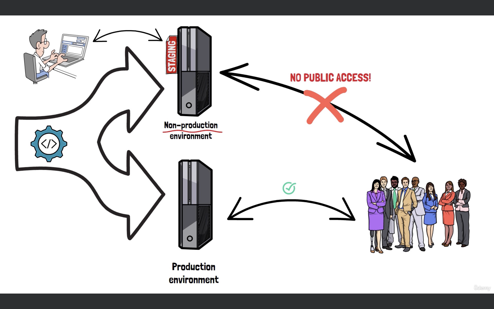

# Continuous Deployment

Continuous Deployment (CD) is a crucial practice in modern software development and DevOps. It refers to the process of automatically deploying code changes to production environments after they pass automated tests and validations. This approach aims to streamline and accelerate the software delivery pipeline, allowing teams to release features, bug fixes, and improvements more frequently and reliably.


Key Components of Continuous Deployment

1. `Version Control System`: A tool like Git, where all the source code and its history are managed. Changes to the codebase are tracked and can be reviewed.

2. `Automated Testing`: A suite of automated tests (unit tests, integration tests, end-to-end tests) that are run to ensure that new code changes don’t introduce bugs or issues.

3. `Continuous Integration (CI)`: The practice of automatically building and testing code changes as they are committed to the version control system.

4. `Automated Deployment Pipeline`: A series of automated steps that include building, testing, and deploying code to production environments. Tools like Jenkins, GitLab CI/CD, CircleCI, and GitHub Actions are commonly used.

5. `Infrastructure as Code (IaC)`: Tools like Terraform, Ansible, or CloudFormation used to manage and provision infrastructure through code, ensuring that environments are consistent and reproducible.

6. `Monitoring and Logging`: Tools like Prometheus, Grafana, ELK Stack, or Splunk to observe the health of applications and gather logs for troubleshooting and performance monitoring.

--------

## Managing Secrets in Jenkins

Storing sensitive information like tokens in Jenkins is essential for security. Jenkins provides a secure mechanism to manage secrets and prevent accidental exposure.
```groovy

                                            +-----------------------+
                                            |                       |
                                            |   Start           |
                                            |                       |
                                            +-----------+-----------+
                                                        |
                                                        v
                                            +-----------+-----------+
                                            |                       |
                                            |   Navigate to your    |
                                            |   Jenkins main page.  |
                                            |                       |
                                            +-----------+-----------+
                                                        |
                                                        v
                                            +-----------+-----------+
                                            |                       |
                                            | Click "Manage Jenkins"|
                                            |    from the sidebar.  |
                                            |                       |
                                            +-----------+-----------+
                                                        |
                                                        v
                                            +-----------+-----------+
                                            |   Click on “Manage    |
                                            |  Credentials” under   |
                                            | the “Security” section|
                                            |                       |
                                            +-----------+-----------+
                                                        |
                                                        v
                                            +-----------+-----------+
                                            |                       |
                                            | Select "(global)" |
                                            |   global credentials. |
                                            |                       |
                                            +-----------+-----------+
                                                        |
                                                        v
                                            +-----------+-----------+
                                            |                       |
                                            |Click "Add Credentials"|
                                            |   on the left sidebar.|
                                            |                       |
                                            +-----------+-----------+
                                                        |
                                                        v
                                            +-----------+-----------+
                                            |                       |
                                            | Choose "Secret text"  |
                                            |  from the "Kind" dropdown. |
                                            |                       |
                                            +-----------+-----------+
                                                        |
                                                        v
                                            +-----------+-----------+
                                            |                       |
                                            | Enter Token Details |
                                            |   - Secret: Paste the Netlify token. |
                                            |   - ID: Enter "Netlify-Token" or another unique ID. |
                                            |   - Description: Optionally describe the token. |
                                            |   - Scope: Ensure "Global" is selected. |
                                            |                       |
                                            +-----------+-----------+
                                                        |
                                                        v
                                            +-----------+-----------+
                                            |                       |
                                            | Save the Credential |
                                            |   Click "OK" to save the new secret text credential. |
                                            |                       |
                                            +-----------+-----------+
                                                        |
                                                        v
                                            +-----------+-----------+
                                            |                       |
                                            |   End             |
                                            |                       |
                                            +-----------------------+

```

A token provides a secure way to grant access to your Netlify account without exposing your username and password. Tokens can have specific permissions and expiration dates, enhancing security by allowing you to control and limit access.

NOTE: A token, unlike a username and password, is automatically generated and can be used to maintain a session or authenticate API requests. A token can be revoked or regenerated without changing the account password. 

-----------------

# Build Periodically

Jenkins offers several build triggers:

1. Build Periodically
2. Build When a Change is Pushed to Git
3. Poll SCM
4. Trigger Builds Remotely
5. GitHub Hook Trigger for GITScm Polling
6. Upstream Projects
7. Pipeline Triggers

1. Build Periodically

The Build Periodically trigger allows you to schedule your Jenkins jobs to run automatically at specified intervals. This is ideal for various scenarios such as long-running jobs or projects requiring regular maintenance.

`Why Use Build Periodically?`

Here are some practical use cases for Build Periodically:

- `Long-Running Jobs:` For jobs that take several hours to complete, you can schedule them to run overnight. For example, you might set a job to run every night at 2 AM, so the results are ready by morning.

  - Example: If you have a nightly build that runs a comprehensive suite of tests, you could schedule it to run every night at 2 AM.
    ```groovy
    H 2 * * *
    ```
    This expression means “Run every day at 2 AM with a random minute.”

- `Maintenance of Inactive Projects:` Even projects that aren’t actively updated can benefit from periodic builds to ensure they remain functional. This can catch issues due to changes in dependencies or environment.

  - Example: For a legacy project that isn’t updated regularly but still requires maintenance, you could schedule a build every Sunday at midnight.
    ```groovy
    H 0 * * 0
    ```
    This expression means “Run every Sunday at midnight.”

How to Use Cron Syntax for Scheduling

Jenkins uses Cron syntax for scheduling builds.

  - Syntax Format: `MINUTE HOUR DAY_OF_MONTH MONTH DAY_OF_WEEK`
  
  - Example: To run a build every weekday at 3 AM, you would use:
    ```
    H 3 * * 1-5
    ```
    This means:
    - H: Distributes load evenly by choosing a random minute within the hour.
    - 3: The job runs at 3 AM.
    - 1-5: Monday through Friday.

NOTE:  The Importance of Using "H" in Cron Syntax

Using the `H` (hash) symbol instead of a specific minute (like `0`) helps balance the load on the Jenkins server. When many jobs are scheduled for the same time, it can cause performance issues.

- Example: Instead of running a job at `0 0 * * *` (midnight every day), use `H 0 * * *` to avoid all jobs running at midnight.

 Examples of Build Periodically Configurations

| Cron Expression | Description                                       |
| --------------- | ------------------------------------------------- |
| `H 2 * * *`     | Runs every day at 2 AM, with a random minute.     |
| `H 0 * * 0`     | Runs every Sunday at midnight.                    |
| `H 1 * * 1-5`   | Runs every weekday at 1 AM, with a random minute. |
| `H */6 * * *`   | Runs every 6 hours at a random minute.            |
| `H 3 1 * *`     | Runs on the 1st of every month at 3 AM.           |

 Limitations of Build Periodically

While Build Periodically is a valuable feature, it’s not always ideal for all scenarios:

- Not for Immediate Feedback: If you need to react to code changes in real-time, Build Periodically might be too slow. For immediate feedback, you might consider Build When a Change is Pushed to Git or Polling SCM.

  - Example: For a continuous integration pipeline where you want immediate feedback on code changes, use SCM polling:
    ```
    Poll SCM every 15 minutes
    ```

- Resource Management: Running builds too frequently can waste resources if there are no changes to the code.

  - Example: Running a build every minute might be excessive and waste server resources. Instead, balance the frequency to match your needs.


------------------

## Automating Jenkins Builds with Poll SCM

Instead of running builds at fixed intervals, Poll SCM allows Jenkins to check the source code repository for changes and trigger builds only when changes are detected. This method is often referred to as Git Polling.

Jenkins periodically checks your GitHub repository for any updates. When it detects new commits, it triggers the pipeline to build and test the latest code changes.


- GitHub Push Event: In an ideal scenario, GitHub would send a notification to Jenkins about changes (webhooks). However, this requires configuring webhooks and making your Jenkins server publicly accessible, which might pose security risks and add complexity. 

- Polling: The simpler alternative is Poll SCM, where Jenkins checks for changes at regular intervals.

Benefits:
   - `Automatic Builds:` Triggers builds automatically when changes are detected.
   - `Simple Setup:` Easier to configure than webhooks.
   - `Good for Most Use Cases:` Suitable for many CI/CD workflows.

Drawbacks:
   - `Polling Interval Limitations:` Frequent polling can consume resources. Using too short intervals (like every minute) can lead to unnecessary load.
   - `Not Real-Time:` There is a delay between code changes and build triggers based on the polling schedule.


NOTE: Poll SCM is a practical alternative to the manual “Build Now” button for automating Jenkins builds. It checks your GitHub repository at regular intervals and triggers builds only when changes are detected, making it ideal for most CI/CD workflows where you need builds to start automatically based on code changes.

----------------


# Staging Environment

A staging environment is a replica of the production environment where final testing of the application or system occurs before it is released to end users. It is designed to simulate the production environment as closely as possible to identify any issues that could affect the final deployment.

Key Characteristics of a Staging Environment

1. `Replica of Production`:
   - Infrastructure: The hardware, network configurations, and system setup mirror the production environment.
   - Software: The staging environment uses the same versions of the operating system, web server, application server, and database as production.

2. `Realistic Data`:
   - It often uses a subset of production data or anonymized data to ensure tests are as realistic as possible without exposing sensitive information.

3. `Testing Grounds`:
   - It’s the final step for quality assurance, where final integration testing, user acceptance testing (UAT), and performance testing are conducted.



---------------------

# Implementing an Approval Step in Jenkins Pipeline

In Jenkins, you can pause your pipeline for a manual review or approval using the `input` step. 

Set up a basic pipeline script with two stages: `build` and `deploy`. Here’s a sample script for the pipeline:

```groovy
pipeline {
    agent any
    stages {
        stage('Build') {
            steps {
                echo 'Building...'
            }
        }
        # Approval Stage (can be generated with jenkins generate snippted)
        stage('Approval') {
            steps {
                script {
                    input message: 'Ready to deploy?', ok: 'Proceed'
                }
            }
        }
        stage('Deploy') {
            steps {
                echo 'Deploying...'
            }
        }
    }
}
```


 Add a Timeout to the Approval Step

To prevent the pipeline from waiting indefinitely, you can add a timeout to the `input` step. Here’s how to configure a one-minute timeout:

```groovy
stage('Approval') {
    steps {
        script {
            timeout(time: 1, unit: 'MINUTES') {
                input message: 'Ready to deploy?', ok: 'Proceed'
            }
        }
    }
}
```

- `timeout(time: 1, unit: 'MINUTES')`: Sets a timeout of 1 minute. Adjust `time` and `unit` as needed.


# 7. Example Pipeline Script with Timeout and Custom Messages

Here’s an example of a complete Jenkinsfile with a timeout and custom messages:

```groovy
pipeline {
    agent any
    stages {
        stage('Build') {
            steps {
                echo 'Building...'
            }
        }
        stage('Approval') {
            steps {
                script {
                    timeout(time: 1, unit: 'MINUTES') {
                        input message: 'Ready to deploy?', ok: 'Yes, I am sure I want to deploy'
                    }
                }
            }
        }
        stage('Deploy') {
            steps {
                echo 'Deploying...'
            }
        }
    }
    post {
        aborted {
            echo 'Pipeline was aborted.'
        }
    }
}
```

-------------------------


## Automating the Deployment Pipeline: Key Steps

Goal: Get deployment details in JSON format for easier extraction of the staging URL. This command saves the deployment details, including the staging URL, to a file called `deploy-output.json`. Extract the `deploy_url` from the JSON file for further use. This command reads `deploy-output.json` and extracts the `deploy_url`, which can be used in the next stage of the pipeline.


Example Pipeline Configuration:

```groovy
    npm install netlify-cli node-jq

    echo "netlify Version:" > versionFile
    node_modules/.bin/netlify --version >> versionFile

    echo 'Deploying to Netlify with site id: ${NETLIFY_SITE_ID}'

    node_modules/.bin/netlify  status
    node_modules/.bin/netlify  deploy --dir=build --json > deploy-output.json
    node_modules/.bin/node-jq -r '.deploy_url' deploy-output.json
```


| Deploy and Save JSON Output | `netlify deploy --json > deploy-output.json`          | Save deployment details in JSON format                  |
| Install `jq`                | `npm install -g jq`                                   | Install the tool to parse JSON                          |
| Extract Staging URL         | `jq -r '.deploy_url' deploy-output.json`              | Extract the `deploy_url` from the JSON file             |


------------------

# Passing Dynamic data b/w stages

In Jenkins pipelines, you might need to pass dynamic data from one stage to another. Since dynamic data is not known beforehand, you can't hardcode it. Instead, you can use Groovy scripting within a `script` block to set environment variables that can be accessed by subsequent stages.

Key Concepts

1. `Script Block`: Allows you to run Groovy code to set environment variables or perform complex logic.
2. `Environment Variables`: Variables can be set in one stage and accessed in another stage using a special syntax.
3. `Dynamic Data`: Data that changes each time the pipeline runs, such as the current date or results from a command.

## Example Scenario

Imagine you want to pass the current date from a Deploy Staging stage to an End to End stage.

1. Pipeline Configuration

      - Deploy Staging Stage: Set a dynamic environment variable.
      - End to End Stage: Access the environment variable set in the previous stage.

```groovy
pipeline {
    agent any

    stages {
        stage('Deploy Staging') {
            steps {
                script {
                    // Set the current date as an environment variable
                    env.DYNAMIC_DATE = sh(script: 'date', returnStdout: true).trim()
                }
            }
        }
        stage('End to End') {
            steps {
                // Access the environment variable set in the previous stage
                echo "The date in Deploy Staging was: ${env.DYNAMIC_DATE}"
            }
        }
    }
}
```

## Explanation

1. `script` Block: In the Deploy Staging stage, the `script` block is used to run a `sh` command that retrieves the current date. The `returnStdout: true` option ensures the output of the command is returned as a string.
2. Environment Variable: `env.DYNAMIC_DATE` stores the current date and is available in subsequent stages.
3. Accessing Variable: In the End to End stage, you access the `DYNAMIC_DATE` variable and print it using `echo`.

