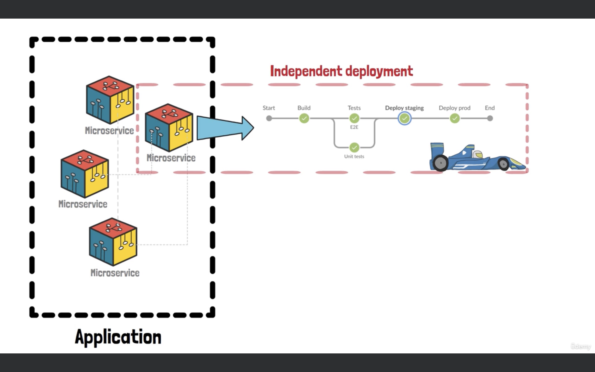

#  Docker and Jenkins Integration

## What is Docker?
Docker is a platform that automates the deployment of applications inside lightweight, portable containers. Containers package an application and its dependencies, making it easy to run the application consistently across different environments.

## What is Jenkins?
Jenkins is an open-source automation server used to automate various stages of the software development lifecycle, such as building, testing, and deploying applications.

## Why Integrate Docker and Jenkins?
Integrating Docker with Jenkins allows you to streamline the CI/CD (Continuous Integration/Continuous Deployment) process. Docker containers provide a consistent environment for building, testing, and deploying applications, while Jenkins automates these processes.




### Key Integration Points

1. Building Docker Images:
   - Jenkins Pipeline: Use Jenkins pipelines to define build steps. You can create Docker images during the build process with commands like `docker build`.
   - Jenkins Plugins: The Docker Pipeline plugin allows you to easily interact with Docker from your Jenkinsfile.

2. Running Tests in Docker Containers:
   - Test Isolation: Jenkins can spin up Docker containers to run tests in isolated environments, ensuring consistent and repeatable test results.
   - Docker Test Containers: Define test steps in your Jenkins pipeline that use Docker images to create containers for running your tests.

3. Deploying Applications:
   - Deploy with Docker: Jenkins pipelines can automate the deployment of Docker containers to various environments (e.g., staging, production).
   - Docker Commands: Use Jenkins pipelines to run Docker commands for pushing images to a registry and deploying them to Docker hosts.

4. Jenkins Docker Agents:
   - Dynamic Agents: Configure Jenkins to use Docker containers as build agents. This approach helps in scaling builds and isolating build environments.
   - Jenkins Docker Plugin: This plugin allows Jenkins to dynamically create Docker containers as build agents.

### Common Tools and Plugins

- Docker Pipeline Plugin: Adds support for Docker in Jenkins pipelines.
- Docker Commons Plugin: Provides shared Docker-related functionalities.
- Pipeline DSL: Use Groovy-based DSL in Jenkinsfiles to define your build and deployment workflows.

### Basic Pipeline Example

Here’s a simple Jenkins pipeline script to build a Docker image, run tests, and deploy:

```groovy
pipeline {
    agent any  // Use any available agent for the pipeline

    environment {
        // Define environment variables, if any
        REGISTRY_URL = 'https://my-docker-registry.example.com'
        IMAGE_NAME = 'my-app'
        IMAGE_TAG = 'latest'
        CREDENTIALS_ID = 'my-docker-credentials'  // Jenkins credentials for Docker Registry
    }

    stages {
        stage('Checkout Code') {
            steps {
                // Checkout the source code from the version control system
                git 'https://github.com/my-repo/my-app.git'
            }
        }

        stage('Build Docker Image') {
            steps {
                script {
                    // Build a Docker image from the Dockerfile in the repository
                    docker.build("${IMAGE_NAME}:${IMAGE_TAG}")
                }
            }
        }

        stage('Run Unit Tests') {
            steps {
                script {
                    // Run unit tests inside a Docker container
                    docker.image("${IMAGE_NAME}:${IMAGE_TAG}").inside {
                        sh 'npm test'  // Example command for running unit tests
                    }
                }
            }
        }

        stage('Push Docker Image') {
            steps {
                script {
                    // Push the Docker image to a Docker registry
                    docker.withRegistry(REGISTRY_URL, CREDENTIALS_ID) {
                        docker.image("${IMAGE_NAME}:${IMAGE_TAG}").push(IMAGE_TAG)
                    }
                }
            }
        }

        stage('Deploy Application') {
            steps {
                script {
                    // Deploy the Docker image to a production environment
                    // This example assumes you have a script or command for deployment
                    sh './deploy.sh'  // Example deployment script
                }
            }
        }

        stage('Clean Up') {
            steps {
                script {
                    // Optionally, clean up old Docker images
                    sh 'docker system prune -f'
                }
            }
        }
    }

    post {
        always {
            // Actions to run after all stages, regardless of success or failure
            echo 'Pipeline completed'
        }
        success {
            // Actions to run only if the pipeline is successful
            echo 'Pipeline succeeded!'
        }
        failure {
            // Actions to run only if the pipeline fails
            echo 'Pipeline failed.'
        }
    }
}

```
-------------------------


# Optimizing Jenkins Pipeline by Creating a Nightly Docker Build Job


To optimize the Jenkins pipeline by removing the Docker image build stage from the primary pipeline and creating a separate nightly pipeline for this task.

Steps to Achieve the Optimization

1. Create a New Jenkins Pipeline for Nightly Docker Builds
   - Navigate to Project Root: Ensure you are at the root of your project in Jenkins.
   - Create a New File: Add a new file named `Jenkinsfile-nightly`.
   - Define Pipeline:
     - Copy the existing code from your current Jenkinsfile.
     - Update the stage name to "Build Docker Image".
     - The pipeline will consist of a single stage focused on building the Docker image.

2. Update the Main Jenkins Pipeline
   - Remove Docker Build Stage: Delete the Docker build stage from the current Jenkins pipeline.
   - Ensure Other Stages Are Intact: Confirm that the remaining stages and configurations are correct for the main pipeline.

3. Configure the New Nightly Build Pipeline in Jenkins
   - Create a New Job:
     - Go to Jenkins Dashboard → New Item.
     - Select "Pipeline" and choose "Copy from".
     - Enter `Jenkinsfile-nightly` for the script path.
     - Name the new job something like "Nightly Build Docker Image".
   - Configure Build Schedule:
     - Set up a schedule to run the build periodically (e.g., once per day during the night).
     - Add the cron-like schedule syntax in the "Build Triggers" section to specify the timing.

4. Verify and Commit Changes
   - Commit Changes:
     - Commit the new `Jenkinsfile-nightly` to your repository.
   - Run the Job Manually:
     - Perform an initial manual run of the nightly job to verify that it builds the Docker image correctly.
   - Check Job Execution:
     - Ensure the nightly build job runs at the scheduled time and generates the Docker image.

5. Confirm Main Pipeline Functionality
   - Check the Main Pipeline:
     - Verify that the primary pipeline runs without the Docker build stage and functions as expected with the pre-built Docker image.

6. Considerations for Local Jenkins Installations
   - Local Environment Alert:
     - Note that if Jenkins is running on a local machine that is turned off during the night, the nightly build job will not run. For continuous builds, a server environment is recommended.

### Benefits

- Faster Pipeline Execution: Removing the Docker build stage from the main pipeline speeds up the overall pipeline execution.
- Resource Efficiency: Building Docker images during off-hours optimizes resource usage.

### Example Jenkinsfile for Nightly Build

```groovy
pipeline {
    agent any
    stages {
        stage('Build Docker Image') {
            steps {
                script {
                    // Define the Docker image name and tag
                    def imageName = 'your-docker-image-name'
                    def imageTag = 'latest'  // or another appropriate tag
                    // Build the Docker image
                    sh "docker build -t ${imageName}:${imageTag} ."
                    // Push the Docker image to a registry if needed
                    sh "docker push ${imageName}:${imageTag}"
                }
            }
        }
    }
}
```

---

By following these steps, you optimize your Jenkins pipelines, balancing efficiency and resource management. If you have any more questions or need further adjustments, feel free to ask!