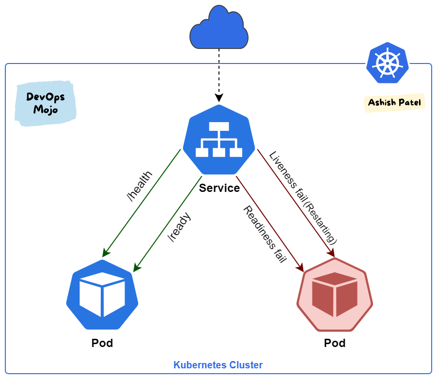

# Kubernetes: Readiness Probes

Introduction
Observability in Kubernetes involves understanding and monitoring the state and health of applications running inside pods. This ensures that Kubernetes can efficiently manage resources and route traffic only to pods that are ready to serve users.

Pod Lifecycle Recap

- `Pending State:` Pod is scheduled but not yet running due to resource allocation.
- `Container Creating:` Containers are being created and initialized.
- `Running State:` All containers are running and the pod is ready to serve traffic.
- `Terminated State:` Pod has completed its execution or terminated due to an error.

Importance of Readiness Probes

- `Definition:` Readiness probes are used to determine if a container is ready to accept traffic.
- `Usage:` Essential when applications require initialization time (e.g., databases, web servers) before serving traffic.
- `Default Behavior:` Kubernetes assumes readiness as soon as containers are created, potentially leading to service disruptions if the application isn't ready.


-----

Configuring Readiness Probes
- `Probe Types:`
  - `HTTP GET:` Checks if a specified HTTP endpoint returns success.
  - `TCP Socket:` Tests if a TCP socket is listening on a specified port.
  - `Exec Command:` Executes a command inside the container and checks the exit status.

- `Probe Parameters:`
  - `Initial Delay Seconds:` Additional time before the probe starts (useful for startup delays).
  - `Period Seconds:` Frequency of probe checks.
  - `Failure Threshold:` Number of consecutive failures before considering the probe as failed.

Example: HTTP GET Readiness Probe
```yaml
apiVersion: v1
kind: Pod
metadata:
  name: example-pod
spec:
  containers:
  - name: example-container
    image: nginx
    readinessProbe:
      httpGet:
        path: /ready
        port: 80
      initialDelaySeconds: 15
      periodSeconds: 10
```

Multi-Pod Setup
- `Scenario:` Multiple pods behind a service.
- `Issue without Readiness Probes:` Adding a new pod might disrupt traffic if not immediately ready.
- `With Readiness Probes:` New pod only receives traffic once ready, ensuring seamless service.

Diagram


Conclusion
Readiness probes are critical for ensuring Kubernetes efficiently manages pod traffic based on application readiness. By configuring appropriate probes, developers can prevent service disruptions and ensure a smooth user experience.

---

This note summarizes the key concepts and configurations related to readiness probes in Kubernetes, providing a clear understanding of their importance and implementation.

