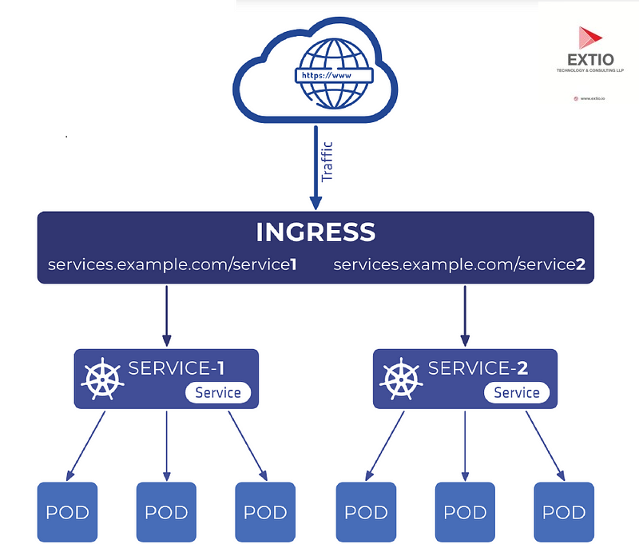

# Ingress 

In Kubernetes, **Ingress** is an API object that manages external access to services within a cluster, typically HTTP and HTTPS. It provides a way to route external traffic to multiple services based on rules defined in the Ingress resource.

### Why Use Ingress?

Before Ingress, exposing services externally in Kubernetes required setting up individual services or using NodePort or LoadBalancer types, which could be cumbersome and expensive when managing multiple services. Ingress simplifies this by providing a single point of entry and allowing routing based on HTTP rules.

### Key Components of Ingress

1. **Ingress Controller:**
   - An Ingress controller is a pod that runs a controller application (e.g., NGINX, HAProxy) responsible for fulfilling the Ingress rules.
   - It watches for Ingress resources and manages the configuration of the underlying load balancer or reverse proxy accordingly.

2. **Ingress Resource:**
   - An Ingress resource is a Kubernetes resource that defines how to route external HTTP(S) traffic to services inside the cluster.
   - It consists of rules and configurations that specify how traffic should be directed based on hostnames, paths, etc.

## Detailed Explanation with Example

Example Scenario

Let's consider an example scenario of an e-commerce application hosted on Kubernetes:

- **Services:**
  - `wear-service`: Handles requests related to clothing.
  - `video-service`: Handles requests related to video streaming.

#### Step-by-Step Configuration

1. Deploying an Ingress Controller:

First, you need to deploy an Ingress controller. We'll use NGINX as an example.

```yaml
apiVersion: apps/v1
kind: Deployment
metadata:
  name: nginx-ingress-controller
spec:
  replicas: 1
  selector:
    matchLabels:
      app: nginx-ingress
  template:
    metadata:
      labels:
        app: nginx-ingress
    spec:
      containers:
        - name: nginx-ingress-controller
          image: nginx/nginx-ingress:latest
          ports:
            - name: http
              containerPort: 80
            - name: https
              containerPort: 443
```

This deploys an NGINX Ingress controller with one replica.

2. Expose the Ingress Controller:

Create a Service to expose the NGINX Ingress controller:

```yaml
apiVersion: v1
kind: Service
metadata:
  name: nginx-ingress
spec:
  type: NodePort
  ports:
    - port: 80
      targetPort: 80
      protocol: TCP
      name: http
    - port: 443
      targetPort: 443
      protocol: TCP
      name: https
  selector:
    app: nginx-ingress
```

This creates a NodePort service exposing ports 80 (HTTP) and 443 (HTTPS) for the NGINX Ingress controller.

3. Defining Ingress Resources:

Now, define Ingress resources to route traffic to `wear-service` and `video-service`.

```yaml
apiVersion: networking.k8s.io/v1
kind: Ingress
metadata:
  name: my-online-store-ingress
spec:
  rules:
    - host: my-online-store.com
      http:
        paths:
          - path: /wear
            pathType: Prefix
            backend:
              service:
                name: wear-service
                port:
                  number: 80
          - path: /watch
            pathType: Prefix
            backend:
              service:
                name: video-service
                port:
                  number: 80
```

In this example:
- Traffic to `my-online-store.com/wear` is routed to `wear-service`.
- Traffic to `my-online-store.com/watch` is routed to `video-service`.

### Diagrammatic Representation

Here's a diagram illustrating the setup:

```
                 +----------------------+
                 | Ingress Controller   |
                 | (e.g., NGINX)        |
                 +-----------+----------+
                             |
                   +---------+---------+
                   | NGINX Service     |
                   | (NodePort)        |
                   +---------+---------+
                             |
        +---------+----------+---------+--------------+
        |         |                    |              |
   +----+----+ +--+----+          +----+----+    +----+----+
   | Service | | Service|          | Service |    | Service |
   | (wear)  | | (video)|          | (other) |    | (etc.)  |
   +---------+ +-------+          +---------+    +---------+
```

### Explanation:

- Ingress Controller: Monitors Ingress resources and configures the NGINX server accordingly.
- Ingress Resource: Defines rules (`/wear`, `/watch`) for routing traffic based on paths.
- Services: `wear-service`, `video-service`, and others are backend services within the Kubernetes cluster.

### Additional Considerations

- TLS Termination: You can configure Ingress to terminate TLS (HTTPS) traffic.
- Domain-Based Routing: Specify hosts in Ingress rules to route traffic based on domain names.
- Path-Based Routing: Use path definitions (`pathType: Prefix`) to direct traffic to different services based on URL paths.

### Conclusion

Ingress in Kubernetes simplifies external access and traffic routing by consolidating routing rules into a single resource. By defining Ingress resources, you can effectively manage HTTP(S) traffic, handle multiple services, and provide flexibility in routing based on paths and domains.

This detailed overview covers the essentials of Ingress, from its components to practical examples and diagrams, illustrating how it enhances the management of external access in Kubernetes environments.

