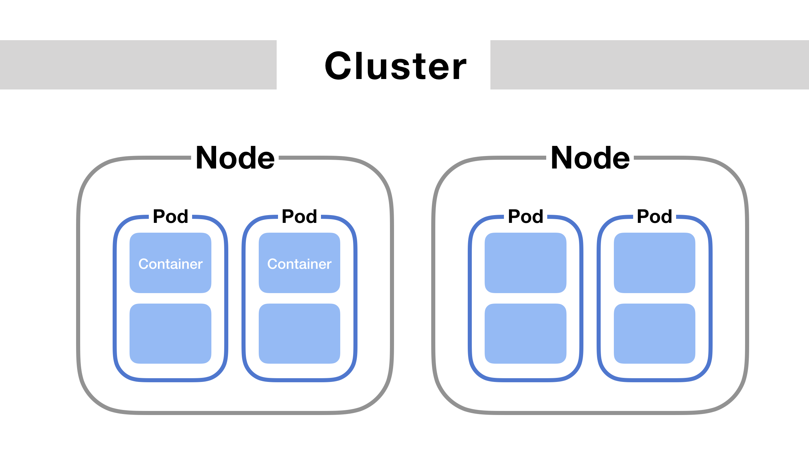

# PODS

In Kubernetes, a `Pod` is the smallest deployable unit that can be created and managed. It represents a single instance of a running process in the cluster, which may consist of one or more containers that share resources, such as storage and networking, and are scheduled together on the same node.

-----------------

### Key Characteristics of Pods:

1. `Pod Definition`:
   - A Pod is defined using a YAML or JSON manifest file, which specifies details such as which containers are included, the images to use, and how they should interact with each other and the cluster.

2. `Primary Purpose`:
   - Pods are the basic building blocks of Kubernetes applications. They are typically used to run a single instance of a containerized application, but multiple containers within a Pod can work together to form a cohesive unit of service.

3. `! Shared Context`:
   - Containers within the same Pod share the same network namespace, allowing them to communicate with each other over localhost. They can also share volumes, which are directories that exist within the Pod's filesystem.

4. `Atomic Scheduling Unit`:
   - Kubernetes schedules Pods onto nodes in the cluster, treating each Pod as a single unit. This means that all containers in a Pod are always scheduled together on the same node.

5. `Lifetime`:
   - Pods are considered ephemeral and are designed to be disposable. They can be created, deleted, and replaced by Kubernetes controllers based on scaling policies, application updates, or failures.

---------------------

### Why Pods Are Used:

- `Multi-container Applications`: Pods facilitate running co-located and tightly coupled containers that need to share resources and communicate with each other over localhost.
  
- `Grouping Containers`: Pods are useful for applications that require helper processes alongside the main application container, such as logging agents, monitoring tools, or sidecar containers that augment the main container's functionality.

### Example Pod Manifest (YAML):

```
apiVersion: v1
kind: Pod
metadata:
  name: nginx-pod
  labels:
    app: nginx
spec:
  containers:
    - name: nginx
      image: nginx:latest
      ports:
        - containerPort: 80
```

In this example:

- The Pod named `nginx-pod` contains a single container (`nginx`) based on the `nginx:latest` Docker image.
- The container listens on port 80 (`containerPort: 80`).
- The Pod is labeled with `app: nginx`, which can be used for selecting Pods using Kubernetes labels and selectors.

---------------------

### Managing Pods:

- `Creating a Pod`: Use `kubectl apply -f pod.yaml` to create a Pod based on a manifest file.
  
- `Viewing Pods`: Use `kubectl get pods` to list all Pods in the current namespace.
  
- `Inspecting a Pod`: Use `kubectl describe pod <pod_name>` to get detailed information about a specific Pod, including its status, containers, events, and more.
  
- `Deleting a Pod`: Use `kubectl delete pod <pod_name>` to delete a Pod and its associated resources.

Pods are fundamental to Kubernetes operations, providing a flexible and scalable mechanism for deploying and managing containerized applications within a cluster.




\*IMP: Kubernetes employs Pods as the smallest deployable units, encapsulating one or more containers that share resources like networking and storage. Pods are essential for managing instances of applications, scaling them by creating new Pods rather than adding containers to existing ones. `Pods typically have a 1-to-1 relationship with application containers, Kubernetes supports multiple containers within a single Pod for tasks like supporting processes or data processing alongside the main application.`