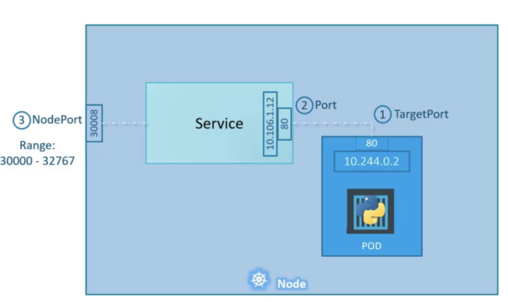
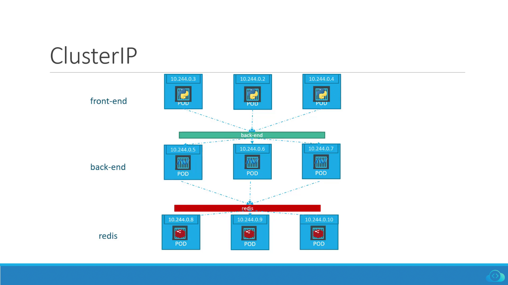
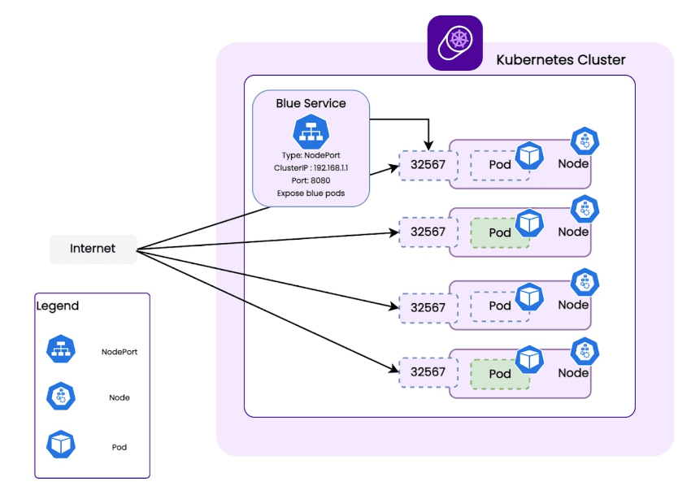

# Services

Kubernetes services facilitate communication between various components within an application and with external entities. They enable connectivity between different groups of pods (components), such as front end, back end, and external data sources, promoting loose coupling in microservices architecture.

Use Case and External Communication:

- `Example Setup:`
  - Kubernetes node: IP - 192.168.1.2
  - Laptop IP: 192.168.1.10
  - Pod network: 10.240.4.0/24, Pod IP: 10.240.4.0.2

- `Accessing Web Application:`
  - Direct access to pod IP (10.240.4.0.2) isn't possible due to network separation.
  - Options include accessing from within the node or using a Kubernetes Service for external access.

-----

Types of Kubernetes Services:

1. `NodePort:`
   - Exposes a port on each node in the cluster.
   - Maps external requests to pods based on configured port mappings.
   - Example: NodePort 30008 maps to Pod's port 80.

2. `ClusterIP:`
   - Provides a stable internal IP for communication within the cluster.
   - Used for services that need to communicate only within the cluster.

3. `LoadBalancer:`
   - Utilizes cloud provider's load balancer to distribute traffic across multiple pods.
   - Ideal for load balancing across front-end web servers.

----


NodePort Service in Detail:

- `Service Definition:`
  - Defined using YAML configuration file.
  - Includes API version, kind (service), metadata (name), and spec (type: NodePort, ports array with targetPort, port, and nodePort).

- `Linking Service to Pods:`
  - Uses labels and selectors to associate pods with the service.
  - Selector in the service configuration file matches labels on the pods.

- `Multiple Pods Scenario:`
  - Service automatically discovers and includes all pods matching the selector.
  - Implements internal load balancing using a random algorithm across multiple pods.

- `Cross-Node Communication:`
  - Service spans across all nodes in the cluster.
  - Provides uniform access via any node's IP and the assigned nodePort (e.g., 192.168.1.2:30008).

`Summary:`

- Kubernetes Services simplify networking by abstracting the complexity of pod IPs and node configurations.
- They ensure flexibility and adaptability as pods scale or move within the cluster.
- Once configured, services dynamically update with pod changes without manual intervention.

`Conclusion:`

- Kubernetes Services are crucial for enabling seamless communication within microservices architectures.
- They enhance scalability, reliability, and maintainability of applications by managing networking aspects effectively.

`Diagram References:`
- Diagrams illustrating network setups, service configurations (NodePort, ClusterIP, LoadBalancer), and pod-to-service mappings.

---

`Additional Notes:`
- `Demo:` Practical demonstrations on creating and accessing Kubernetes Services using `kubectl` commands.
- `Further Reading:` Explore advanced topics such as service discovery, service mesh, and ingress controllers for more complex Kubernetes networking scenarios.

This concludes the transcript of the lecture on Kubernetes Services, covering fundamentals, practical applications, and configurations.


---------------------

# NodePort 

Definition and Purpose

- `NodePort` is one of the types of Kubernetes services that exposes a service on each node's IP at a static port. It allows external traffic to reach services running on the cluster nodes.
  
- NodePort is typically used when you need to expose your application outside the Kubernetes cluster, but you don't want to use an external load balancer or when you need to test applications in development environments.

Key Components:
------

- `Target Port:` The port on which the application is running inside the pod. This is where the NodePort service forwards the traffic.
- `Port:` The port that the NodePort service listens on within the cluster. Traffic sent to this port gets forwarded to the target port of the pods.
- `Node Port:` This is the port that is exposed on each node of the cluster. It is the port that external clients can use to access the service.

Configuration:  
  ```yaml
  apiVersion: v1
  kind: Service
  metadata:
    name: my-service
  spec:
    type: NodePort
    ports:
      - targetPort: 80     # Port on the pod
        port: 80           # Port exposed by the service within the cluster
        nodePort: 30008    # Port accessible externally on each node
    selector:
      app: my-app          # Label selector to match pods
  ```
  
Explanation:
  - `apiVersion`: Specifies the Kubernetes API version (`v1` for the current API version).
  - `kind`: Defines the type of Kubernetes resource (`Service`).
  - `metadata`: Contains metadata about the service, including its name.
  - `spec`: Specifies the service's configuration details.
    - `type`: Specifies the type of service (`NodePort` in this case).
    - `ports`: An array specifying the ports to be exposed by the service.
      - `targetPort`: The port number on the pod where the application is running (e.g., 80 for HTTP).
      - `port`: The port number that the service listens on within the cluster (also 80 in this case).
      - `nodePort`: The port number that will be exposed on each cluster node (e.g., 30008).
    - `selector`: Defines how the service identifies which pods to target based on labels (`app: my-app`).

Usage Scenarios:
- `Accessing Applications:` Use NodePort when you need to access applications running inside Kubernetes pods from outside the cluster, such as during development or testing phases.
- `Simplifying External Access:` NodePort simplifies access without requiring complex networking setups or external load balancers.
- `Service Discovery:` Clients can access services using any node's IP address and the specified nodePort.

---

Advantages:
- `Simplicity:` Easy to set up and configure compared to other service types like LoadBalancer.
- `Flexibility:` Provides a straightforward way to expose services for development or small-scale deployments.
- `Uniformity:` Offers a uniform way to access services across all nodes using a consistent nodePort.

----

Limitations:
- `Security Concerns:` Exposes services on static ports, which might pose security risks if not properly managed.
- `Port Range:` Limited range of available nodePorts (30000-32767 by default) might be restrictive in certain scenarios with many services.

`Conclusion:`
- NodePort services in Kubernetes provide a simple and effective way to expose applications running in pods to external clients. They are suitable for various use cases, especially in development and small-scale production environments where simplicity and ease of access are prioritized.

`References:`
- Kubernetes.io: [Service - NodePort](https://kubernetes.io/docs/concepts/services-networking/service/#nodeport)

---

This summary covers the fundamentals of NodePort services in Kubernetes, including their definition, configuration, usage scenarios, advantages, and limitations.




## CMD

   To list all services in the current namespace:

   ```bash
   kubectl get services
   ```

   This command displays information about each service, including its name, type, cluster IP, external IP (if applicable), ports, and age.

1. `Describe a Service:`

   To get more detailed information about a specific service (replace `my-service` with your service name):

   ```bash
   kubectl describe service my-service
   ```

   This command provides detailed information about the selected service, including its IP addresses, port mappings, selectors, and any associated endpoints.

2. `Delete a NodePort Service:`

   To delete a NodePort service:

   ```bash
   kubectl delete service my-service
   ```

   This command removes the specified service (`my-service` in this example) from the cluster.

3. `Apply Changes to an Existing Service:`

   If you need to update a NodePort service configuration (e.g., change ports or selectors), edit the YAML file and re-apply it:

   ```bash
   kubectl apply -f updated-service.yaml
   ```

 


-----------------------

# ClusterIP services

- A full stack web application comprises different parts serving various functions.
- Frontend servers, backend servers, key-value stores like Redis, and databases like MySQL are common components.




`Communication Challenges:`
- Pods have dynamic IP addresses, which change as pods scale or restart.
- Dependency on IP addresses for communication within the application is unreliable.

`Solution - Kubernetes Service:`
- Kubernetes Service groups pods and provides a stable interface to access them.
- For example, a backend service groups backend pods and provides a single entry point.

`ClusterIP Service:`
- Type of Kubernetes Service that provides an internal, cluster-only IP.
- Ensures internal communication stability without exposing services externally.

Creating a ClusterIP Service:

```yaml
apiVersion: v1
kind: Service
metadata:
  name: backend
spec:
  selector:
    app: backend
  type: cluseterIP  
  ports:
    - protocol: TCP
      port: 80
      targetPort: 80
```

- Apply the service definition:
  ```
  kubectl apply -f backend-service.yaml
  ```

- Check service status:
  ```
  kubectl get services
  ```

`Accessing the Service:`
- Services are accessed via ClusterIP or service name (`backend` in this case).
- Enables seamless communication between application tiers.

`Conclusion:`
- ClusterIP services streamline microservices communication in Kubernetes.
- Each service gets a unique IP and name, facilitating scalable and resilient applications.

---

This structured note encapsulates the main points covered in the lecture on Kubernetes ClusterIP services, including their purpose, creation process, and usage within a microservices architecture.

# LoadBalancer Service



- NodePort services allow external access to applications via worker node ports.
- However, users typically prefer a single URL to access applications, not node IP addresses and ports.

Challenge:
- How to provide a single, accessible URL (e.g., `voting.example.com`, `result.example.com`) for frontend applications like voting and result apps.

Solution - LoadBalancer Service:
- Create a VM with a suitable load balancer (e.g., Nginx, HAProxy).
- Configure the load balancer to route traffic to worker nodes hosting the applications.
- This approach requires external load balancer setup, management, and maintenance.

Cloud Provider Integration:
- Supported cloud platforms (e.g., Google Cloud Platform, AWS, Azure) offer native load balancers.
- Kubernetes integrates with these cloud providers' load balancers seamlessly.
- Set service type to `LoadBalancer` to leverage native cloud load balancers.

Implementation:

  ```yaml
  apiVersion: v1
  kind: Service
  metadata:
    name: voting-app
  spec:
    type: LoadBalancer
    selector:
      app: voting
    ports:
      - protocol: TCP
        port: 80
        targetPort: 80
  ```

- Apply the service definition:
  ```
  kubectl apply -f voting-app-service.yaml
  ```

- Kubernetes configures native cloud load balancer (if supported) to route external traffic to the voting app.

`Cloud Platform Support:`
- Native load balancers provided by GCP, AWS, Azure automatically route traffic to Kubernetes services.
- Simplifies external access management and URL provisioning for applications.

`Conclusion:`
- LoadBalancer services in Kubernetes simplify external access management for applications.
- Ideal for deploying applications on supported cloud platforms to provide a seamless user experience.

---

This structured lecture note covers the importance of LoadBalancer type services in Kubernetes, how they address challenges with external access, and their integration with native cloud load balancers for streamlined application deployment and management.