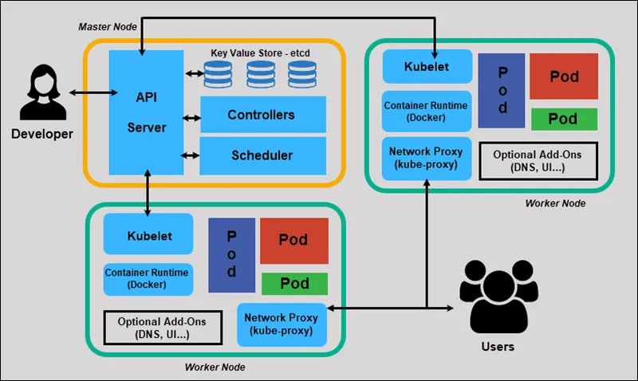
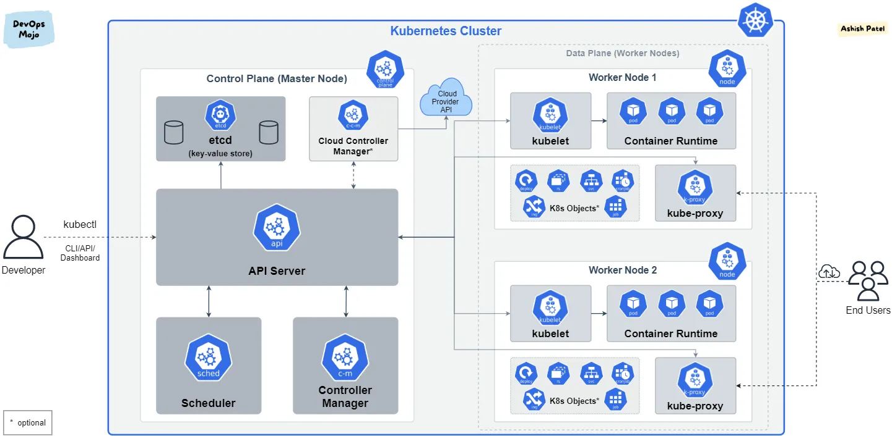

# Kubernetes (k8s)

Kubernetes is an open-source platform designed to automate the deployment, scaling, and management of containerized applications. Originally developed by Google and now maintained by the Cloud Native Computing Foundation (CNCF), Kubernetes provides a container-centric infrastructure. It allows you to deploy your applications quickly and predictably, scale them seamlessly, and manage them efficiently across clusters of hosts.

## Docker

`Container`: A container is a lightweight, standalone, executable package of software that includes everything needed to run an application: code, runtime, system tools, system libraries, and settings. Containers isolate applications from each other and from the underlying infrastructure, providing consistency across different computing environments (development, testing, production, etc.).

 `Docker Image`: An image is a read-only template that defines the instructions for creating a Docker container. It includes everything needed to run a containerized application, such as the application code, runtime, libraries, environment variables, and configuration files. Images are built using a Dockerfile, which specifies the steps needed to create the image.

Docker has revolutionized application development and deployment by making it easier to package and distribute applications in containers. Containers offer consistency, portability, and efficiency, making them popular for microservices architectures, continuous integration/continuous deployment (CI/CD) pipelines, and cloud-native applications.

## Container Advantage

Containers offer several advantages that make them popular for modern application development and deployment:

1. `Portability`: Containers encapsulate an application and its dependencies into a single package, making it easy to deploy and run consistently across different computing environments (development, testing, production, etc.). This portability ensures that the application behaves the same way regardless of where it is deployed.

2. `Consistency`: Containers provide a consistent environment for applications to run, regardless of differences in the underlying host system. This consistency helps eliminate the classic "it works on my machine" problem by ensuring that the application runs reliably across different environments.

3. `Isolation`: Containers provide lightweight isolation for applications. Each container runs as an isolated process with its own filesystem, network, and process namespace. This isolation ensures that applications running in containers do not interfere with each other, enhancing security and stability.

4. `Resource Efficiency`: Containers share the host system's kernel and resources, such as CPU, memory, and storage, making them lightweight compared to traditional virtual machines (VMs). This efficiency allows you to run more containers on the same hardware, optimizing resource utilization and reducing costs.

5. `Speed`: Containers can be started and stopped quickly, typically in seconds. This rapid deployment speed accelerates development cycles and enables faster deployment of applications, making containers ideal for agile and DevOps practices.

6. `Scalability`: Containers are designed to be scalable. They can be easily replicated and orchestrated to handle varying workloads and traffic demands. Container orchestration platforms like Kubernetes automate the deployment, scaling, and management of containers, further enhancing scalability.

7. `Microservices Architecture`: Containers are well-suited for microservices architectures, where applications are broken down into smaller, loosely coupled services. Each service can be deployed independently in its own container, allowing for easier development, deployment, and scaling of individual components.

8. `Version Control and Rollbacks`: Docker images, which are used to create containers, are versioned and can be stored in repositories like Docker Hub. This enables version control for applications and easy rollback to previous versions if needed.

Overall, containers provide a flexible, efficient, and scalable way to develop, deploy, and manage applications in modern IT environments, making them a cornerstone of cloud-native development and DevOps practices. 

## Container orchestration

Container orchestration refers to the automated management, deployment, scaling, and operation of containerized applications. It addresses the complexities involved in running multiple containers across distributed environments. Here are key aspects of container orchestration:

1. `Deployment Automation`: Orchestration platforms automate the deployment process of containerized applications. They manage the lifecycle of containers, ensuring that they are deployed correctly, started, stopped, and updated as needed.

2. `Scaling`: Orchestration enables automatic scaling of containerized applications based on factors like CPU utilization, memory usage, or incoming traffic. It ensures that the application can handle varying workloads efficiently.

3. `Load Balancing`: Orchestration platforms provide built-in mechanisms for load balancing across containers and nodes (hosts) within a cluster. This ensures even distribution of traffic and prevents any single container or node from becoming overloaded.

4. `Service Discovery`: Orchestration tools facilitate service discovery by assigning each container a unique IP address and DNS name. This makes it easier for containers to communicate with each other and for clients to locate services within the cluster.

5. `Health Monitoring and Self-Healing`: Orchestration platforms continuously monitor the health of containers and nodes. They can automatically restart containers that fail, replace unhealthy containers with new ones, and manage failovers to ensure high availability of applications.

6. `Resource Management`: Orchestration tools manage resources such as CPU, memory, and storage across the cluster. They optimize resource allocation and utilization to maximize efficiency and performance.

7. `Rollouts and Rollbacks`: Orchestration platforms support controlled rollouts and rollbacks of application updates. They can update containers gradually (canary deployments) or in batches to minimize downtime and impact on users. In case of issues, they facilitate rollback to a previous version.

8. `Security`: Orchestration tools provide mechanisms for securing containerized applications and the orchestration platform itself. This includes access control, network segmentation, encryption, and vulnerability scanning.

Popular container orchestration platforms include `Kubernetes, Docker Swarm, Apache Mesos, and HashiCorp Nomad`. Among these, 

NOTE: `Kubernetes has emerged as the de facto standard due to its robust feature set, large community support, and extensive ecosystem.`

Container orchestration is essential for managing the complexities of deploying and running containerized applications at scale in modern cloud-native environments. It enables organizations to achieve agility, scalability, reliability, and efficiency in their application delivery pipelines.

## Kubernetes architecture

Nodes in Kubernetes Architecture:
------------------------------------

1.`Master Node:`
   -`API Server:` Acts as the control plane for the Kubernetes cluster. It exposes the Kubernetes API, which users, management tools, and other parts of Kubernetes interact with to manage the cluster.
   -`Scheduler:` Assigns pods (groups of containers) to nodes based on resource requirements and constraints.
   -`Controller Manager:` Manages different aspects of the cluster's state, ensuring that the desired state (as defined by users and applications) matches the actual state.
   -`etcd:` Distributed key-value store that stores cluster configuration and state, ensuring consistency across the cluster.

2.`Worker Node(s):`
   -`Kubelet:` Agent running on each node, responsible for managing the containers and pods running on that node. It interacts with the container runtime (like Docker) to execute containers.
   -`Kube-proxy:` Maintains network rules (iptables) on nodes, enabling communication across the cluster and with external networks. It also manages the routing of traffic to services within the cluster.

3.`Container Runtime:`
   - Software responsible for running containers. Kubernetes supports various runtimes such as Docker, containerd, and others. The container runtime executes containers created from images and manages their lifecycle.

How Nodes Work Together:
-----------------------------

-`Master Node` manages the cluster's overall state and configuration, acting as the brain of the Kubernetes cluster.
-`Worker Nodes` host applications and services as pods. Each node runs Kubelet and Kube-proxy to manage containers and networking, respectively.
-`etcd` ensures that all nodes in the cluster have consistent information about the cluster's state, configurations, and policies.

Node Communication:
----------------------------

-`API Server` on the master node is the entry point for all administrative tasks and communication within the cluster.
-`Kubelet` on each worker node communicates with the API server to receive instructions (like pod deployment) and report node status.
-`Kube-proxy` manages network rules to enable communication between pods and services within the cluster and with external networks.

Scalability and Resilience:
-----------------------------------

- Kubernetes architecture is designed for scalability and resilience. Nodes can be added or removed from the cluster dynamically without disrupting running applications.
- Components like the Scheduler and Controller Manager ensure that workloads are distributed efficiently and that the cluster maintains its desired state.

In summary, Kubernetes architecture revolves around master and worker nodes. The master node manages the cluster's control plane, while worker nodes execute containerized applications and manage networking. This distributed architecture provides flexibility, scalability, and resilience for running modern, cloud-native applications at scale.

## Node Components

Kubernetes architecture is designed to manage containerized applications across a cluster of nodes (servers). It provides a robust framework for automating deployment, scaling, and operations of application containers. Here’s an overview of Kubernetes architecture components:

### Master Components:

1. `API Server`:
   - The central control plane component that exposes the Kubernetes API.
   - It is the front-end for Kubernetes and handles all operations on the cluster, such as deploying applications, scaling, and managing cluster resources.
   
2. `Scheduler`:
   - Watches for newly created pods (a group of one or more containers) that have no assigned node, and selects a node for them to run on.
   - Considers resource requirements, quality of service requirements, and policies such as affinity and anti-affinity specifications.

3. `Controller Manager`:
   - Runs controller processes that regulate the state of the cluster, such as node controller, replication controller, endpoints controller, and namespace controller.
   - Watches for changes in the cluster state (through the API server) and ensures the current state matches the desired state.

4. `etcd`:
   - Consistent and highly-available key-value store used as Kubernetes' backing store for all cluster data (metadata).
   - Stores configuration data that represents the state of the cluster and its configuration.

### Node Components:

1. `Kubelet`:
   - An agent that runs on each node in the cluster.
   - Ensures containers are running in a pod, reporting node health to the Kubernetes master.
   - Interacts with the container runtime (like Docker, containerd) to manage containers on the node.

2. `Kube-proxy`:
   - Maintains network rules on nodes.
   - Implements part of the Kubernetes Service concept by maintaining network rules to allow network communication to your Pods from network sessions inside or outside of your cluster.

3. `Container Runtime`:
   - Software that is responsible for running containers, such as Docker, containerd, or cri-o.
   - Kubernetes is designed to be extensible and support different container runtimes.

### Additional Components:

1. `Kubernetes DNS (kube-dns or CoreDNS)`:
   - Provides DNS-based service discovery and DNS resolution within the cluster.
   - Enables communication between Kubernetes services using their names.

2. `Dashboard` (Optional):
   - Web-based UI for Kubernetes cluster management and monitoring.
   - Allows users to deploy containerized applications, troubleshoot applications, and manage cluster resources.

3. `Ingress Controller` (Optional):
   - Manages external access to services in a Kubernetes cluster, typically HTTP/HTTPS.
   - Routes traffic from outside the cluster to your services inside the cluster.

### How Components Work Together:

- `API Server` acts as the front-end for Kubernetes. Users, the command-line interface (CLI), or other parts of the cluster interact with the API server to manage the cluster.
- `Scheduler` assigns workloads to nodes based on resource requirements and other constraints.
- `Controller Manager` watches for changes and ensures the cluster remains in the desired state.
- `etcd` stores configuration data, allowing Kubernetes to recover state after a restart or failure.
- `Kubelet` and `Kube-proxy` run on each node, managing containers and networking, respectively.

Kubernetes architecture is designed with a modular and extensible approach, enabling it to support a wide range of workloads and configurations, from small development setups to large-scale production environments. Understanding these components helps in deploying, managing, and troubleshooting Kubernetes clusters effectively.

## Kubectl

`kubectl` is the command-line tool used to interact with Kubernetes clusters. It allows you to perform various operations on Kubernetes resources, manage clusters, and troubleshoot issues. Here are some of the most commonly used `kubectl` commands:

Managing Resources:

   - `kubectl apply -f <filename>`: Applies a configuration file to create or update resources in the cluster. This is typically used with YAML files describing Kubernetes resources like pods, services, deployments, etc.
   
   - `kubectl get <resource>`: Retrieves information about one or more resources. For example, `kubectl get pods` lists all pods in the current namespace.
   
   - `kubectl describe <resource> <name>`: Provides detailed information about a specific resource. For example, `kubectl describe pod mypod`.
   
   - `kubectl delete <resource> <name>`: Deletes a specific resource. For example, `kubectl delete pod mypod`.
  

-----------------

Viewing and Logging:

   - `kubectl logs <pod_name>`: Displays the logs of a specific pod. For example, `kubectl logs mypod`.
   
   - `kubectl get events`: Retrieves events from the cluster. Useful for troubleshooting and monitoring activities in the cluster.

------------------

Managing Cluster:

   - `kubectl cluster-info`: Displays cluster information, such as the Kubernetes master's URL and the cluster services endpoints.
   
   - `kubectl config view`: Displays the current kubeconfig configuration, which includes cluster settings, authentication details, and contexts.

-------------------

Scaling and Updating:

   - `kubectl scale <resource_type> <name> --replicas=<number>`: Scales a deployment, replicaset, or statefulset by adjusting the number of replicas.
   
   - `kubectl rollout status <resource_type> <name>`: Monitors the status of a rollout (deployment, daemonset, statefulset, etc.).
   
   - `kubectl rollout history <resource_type> <name>`: Displays the revision history of a rollout.

-------------------------

Interacting with Pods:

   - `kubectl exec -it <pod_name> -- <command>`: Executes a command in a running pod. For example, `kubectl exec -it mypod -- /bin/bash`.
   
   - `kubectl port-forward <pod_name> <local_port>:<pod_port>`: Forwards connections to a port on the local machine to a port on a pod. For example, `kubectl port-forward mypod 8080:80`.

-----------------------

Managing Namespaces:

   - `kubectl get namespaces`: Lists all namespaces in the cluster.
   
   - `kubectl create namespace <name>`: Creates a new namespace.
   
   - `kubectl delete namespace <name>`: Deletes a namespace and all its resources.

These commands cover basic operations with `kubectl`. Kubernetes offers a wide range of features and resources, so `kubectl` commands can be extended and customized with various options and flags to suit specific needs and scenarios in managing Kubernetes clusters and applications.