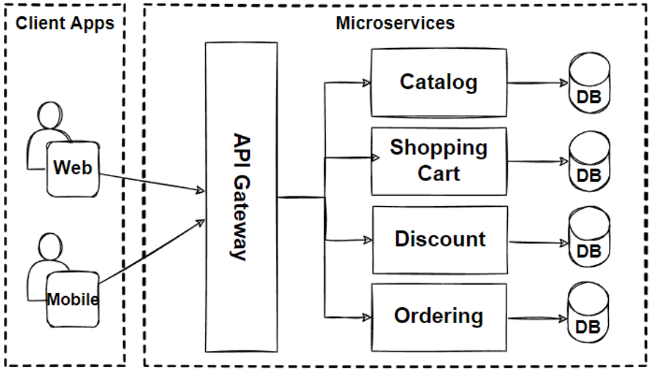

# Microservices

Microservices architecture is an approach to software development where a single application is built as a suite of small, independent services, each running its own process and communicating with lightweight mechanisms, often an HTTP resource API. 

Here are some key characteristics and benefits of microservices architecture:


1. `Decomposed into Services`: Applications are broken down into small, independent services.
   
2. `Independently Deployable`: Each service can be developed, deployed, and scaled independently.
   
3. `Decentralized Data Management`: Each service can have its own database.
   
4. `Resilience`: Failures are isolated within services, minimizing impact on the whole system.
   
5. `Scalability`: Services can be scaled independently based on specific needs.
   
6. `Technology Diversity`: Different services can use different technology stacks.
   
7. `Organizational Alignment`: Supports agile practices and DevOps.
   
8. `Continuous Delivery`: Facilitates frequent releases through CI/CD pipelines.

These points encapsulate the core benefits and considerations of microservices architecture.



-------

EXAMPLE:

Let's begin by understanding our sample application, a voting app provided by Docker. It consists of several components:

1. **Voting App**: A Python web application where users vote between a cat and a dog. Votes are stored in Redis.
   
2. **Redis**: Acts as an in-memory database for storing votes.

3. **Worker**: A .NET application that processes votes and updates a persistent PostgreSQL database.

4. **PostgreSQL**: Stores the vote counts for cats and dogs.

5. **Result App**: A Node.js web application that displays the results from the PostgreSQL database.

## Deployment on Docker

## Data Layer:

1. **Redis**: Start Redis container in the background named `redis`.
   ```bash
   docker run -d --name redis redis
   ```

2. **PostgreSQL**: Start PostgreSQL container in the background named `db`.
   ```bash
   docker run -d --name db postgres
   ```

## Application Services:

1. **Voting App**: Deploy the Python web app and publish its port 5000 to 80 on the host.
   ```bash
   docker run -d --name vote -p 5000:80 voting-app-image
   ```

2. **Result App**: Deploy the Node.js web app and publish its port 5001 to 80 on the host.
   ```bash
   docker run -d --name result -p 5001:80 result-app-image
   ```

3. **Worker**: Run the .NET worker application.
   ```bash
   docker run -d --name worker worker-image
   ```

## Connecting Services

While the containers are running, they are not yet linked to communicate with each other. To link them:

- **Linking Redis to Voting App**:
  ```bash
  docker run -d --name vote --link redis:redis -p 5000:80 voting-app-image
  ```

- **Linking PostgreSQL to Result App**:
  ```bash
  docker run -d --name result --link db:db -p 5001:80 result-app-image
  ```

- **Linking Redis and PostgreSQL to Worker**:
  ```bash
  docker run -d --name worker --link redis:redis --link db:db worker-image
  ```

## Explanation

The `--link` option in Docker establishes a secure tunnel between containers, allowing them to communicate using the linked container’s alias. For example, `--link redis:redis` makes the `redis` container accessible from the `vote` container using the hostname `redis`.

## IMP:  Note on Deprecation

Using `--link` for container communication is deprecated in Docker. Modern practices involve using Docker networks or Docker Compose for managing container communication more effectively.

In summary, we've covered deploying a microservices architecture on Docker, linking containers for inter-service communication using deprecated `--link` options, and highlighted the need for more advanced networking approaches in modern Docker setups. This sets the stage for exploring Kubernetes deployments in subsequent sections.


-----

# application  on Kubernetes

## Steps to Deploy on Kubernetes

1. **Deploying Pods**
   - Kubernetes manages containers through pods. Each component of the voting application (voting app, result app, worker) will initially be deployed as separate pods.
   - Later, we can convert these pods to deployments for better management and scalability.

2. **Connecting Services**
   - Determine connectivity requirements:
     - **Redis**: Accessed by both the voting app and worker.
     - **PostgreSQL**: Accessed by the worker and result app.
     - **Worker**: Does not need external access.
     - **Voting App**: Accessed by external users for voting.
     - **Result App**: Accessed by external users for viewing results.

3. **Creating Kubernetes Services**
   - Services allow communication between pods and external access (if needed).
   - Create services for:
     - **Redis** (Cluster IP service named `redis`):
       ```yaml
       apiVersion: v1
       kind: Service
       metadata:
         name: redis
       spec:
         selector:
           app: redis
         ports:
           - protocol: TCP
             port: 6379
             targetPort: 6379
       ```
     - **PostgreSQL** (Cluster IP service named `db`):
       ```yaml
       apiVersion: v1
       kind: Service
       metadata:
         name: db
       spec:
         selector:
           app: postgres
         ports:
           - protocol: TCP
             port: 5432
             targetPort: 5432
       ```
     - **Voting App** (NodePort service for external access):
       ```yaml
       apiVersion: v1
       kind: Service
       metadata:
         name: voting-app
       spec:
         type: NodePort
         selector:
           app: voting-app
         ports:
           - protocol: TCP
             port: 80
             targetPort: 80
             nodePort: 30001
       ```
     - **Result App** (NodePort service for external access):
       ```yaml
       apiVersion: v1
       kind: Service
       metadata:
         name: result-app
       spec:
         type: NodePort
         selector:
           app: result-app
         ports:
           - protocol: TCP
             port: 80
             targetPort: 80
             nodePort: 30002
       ```

4. **Deployment Strategy**
   - Apply these configurations using `kubectl apply -f <filename>` for each YAML file.
   - Verify pods and services with `kubectl get pods` and `kubectl get services`.

5. **External Access**
   - Access the voting app via `http://<NodeIP>:30001`.
   - Access the result app via `http://<NodeIP>:30002`.

## Summary
In this deployment strategy, we've focused on deploying each component as a pod, establishing internal communication through Kubernetes services (using Cluster IP), and enabling external access to the voting and result applications using NodePort services. This setup ensures that each component can communicate effectively while maintaining security and scalability within the Kubernetes environment.
