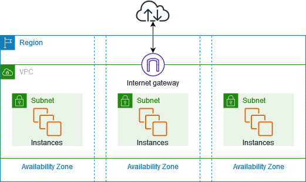

# VPC

Imagine you want to set up a private, secure, and isolated area in the cloud where you can run your applications and store your data. This is where a VPC comes into play.

A VPC is a virtual network that you create in the cloud. It allows you to have your own private section of the internet, just like having your own network within a larger network. Within this VPC, you can create and manage various resources, such as servers, databases, and storage.

Think of it as having your own little "internet" within the bigger internet. This virtual network is completely isolated from other users' networks, so your data and applications are secure and protected.

Just like a physical network, a VPC has its own set of rules and configurations. You can define the IP address range for your VPC and create smaller subnetworks within it called subnets. These subnets help you organize your resources and control how they communicate with each other.

To connect your VPC to the internet or other networks, you can set up gateways or routers. These act as entry and exit points for traffic going in and out of your VPC. You can control the flow of traffic and set up security measures to protect your resources from unauthorized access.

With a VPC, you have control over your network environment. You can define access rules, set up firewalls, and configure security groups to regulate who can access your resources and how they can communicate.

By default, when you create an AWS account, AWS will create a default VPC for you but this default VPC is just to get started with AWS. You should create VPCs for applications or projects.

## VPC components

The following features help you configure a VPC to provide the connectivity that your applications need:

Virtual private clouds (VPC)

    A VPC is a virtual network that closely resembles a traditional network that you'd operate in your own data center. After you create a VPC, you can add subnets.

Subnets

    A subnet is a range of IP addresses in your VPC. A subnet must reside in a single Availability Zone. After you add subnets, you can deploy AWS resources in your VPC.

IP addressing

    You can assign IP addresses, both IPv4 and IPv6, to your VPCs and subnets. You can also bring your public IPv4 and IPv6 GUA addresses to AWS and allocate them to resources in your VPC, such as EC2 instances, NAT gateways, and Network Load Balancers.

Network Access Control List (NACL)

    A Network Access Control List is a stateless firewall that controls inbound and outbound traffic at the subnet level. It operates at the IP address level and can allow or deny traffic based on rules that you define. NACLs provide an additional layer of network security for your VPC.

Security Group

    A security group acts as a virtual firewall for instances (EC2 instances or other resources) within a VPC. It controls inbound and outbound traffic at the instance level. Security groups allow you to define rules that permit or restrict traffic based on protocols, ports, and IP addresses.

Routing

    Use route tables to determine where network traffic from your subnet or gateway is directed.

Gateways and endpoints

    A gateway connects your VPC to another network. For example, use an internet gateway to connect your VPC to the internet. Use a VPC endpoint to connect to AWS services privately, without the use of an internet gateway or NAT device.

Peering connections

    Use a VPC peering connection to route traffic between the resources in two VPCs.

Traffic Mirroring

    Copy network traffic from network interfaces and send it to security and monitoring appliances for deep packet inspection.

Transit gateways

    Use a transit gateway, which acts as a central hub, to route traffic between your VPCs, VPN connections, and AWS Direct Connect connections.

VPC Flow Logs

    A flow log captures information about the IP traffic going to and from network interfaces in your VPC.

VPN connections

    Connect your VPCs to your on-premises networks using AWS Virtual Private Network (AWS VPN).

## Resources

VPC with servers in private subnets and NAT

https://docs.aws.amazon.com/vpc/latest/userguide/vpc-example-private-subnets-nat.html

